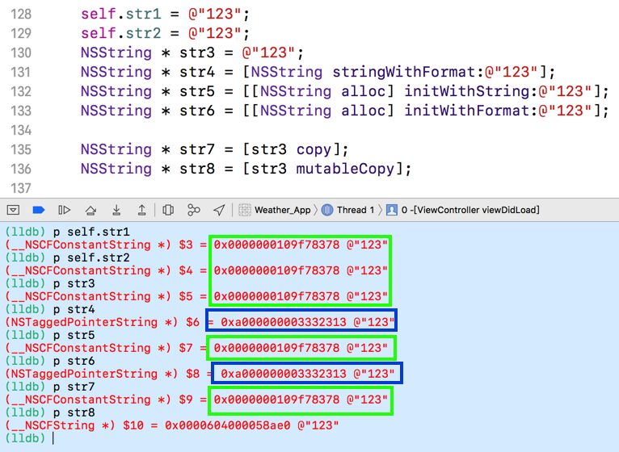
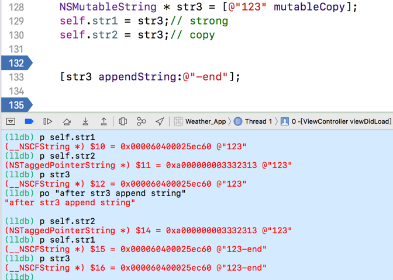

> 理解NSString的**不可变**实质
>
> NSString在Cocoa中是类簇的实现形式

---

### 字符串在内存中的地址

求下面字符串对象在内存中的地址：

```objective-c
self.str1 = @"123";
self.str2 = @"123";
NSString * str3 = @"123";
NSString * str4 = [NSString stringWithFormat:@"123"];
NSString * str5 = [[NSString alloc] initWithString:@"123"];
NSString * str6 = [[NSString alloc] initWithFormat:@"123"];

NSString * str7 = [str3 copy];
NSString * str8 = [str3 mutableCopy];
```



NSString是“==不可变（immutable）==”的类型，这个是关键。

代码中以`@`开头的字符串，其实就是一个字符串常量。运行时会检测这个字符串是否已经存在：

* ✅存在的话，就直接将这个字符串的地址赋给变量；
* ❎不存在的话，则创建，再赋值。

所以上面的alloc和copy操作不会分配新内存，而是直接将已有的内存地址赋给对应的指针。

另外，可以看出来通过format创建的字符串对象，内部的私有类已经与平常创建(initWithString、直接创建)的字符串对象私有类已经不一样了，所以str4和str6的地址是一样的，但是和str3、str5的不一样。

mutableCopy 函数将入参(这里是str3)的对象内存地址复制一份，并将对象由不可变变为可变类型。


### copy和strong

使用不同的修饰方式对一个是字符串类型的属性进行修饰，来决定不同的内存管理方式：

```objective-c
NSMutableString * str3 = [@"123" mutableCopy];
self.str1 = str3;// strong 修饰
self.str2 = str3;// copy 修饰

// 这之前str1...3的值分别是多少？

[str3 appendString:@"-end"];

// 这之后str1...3的值分别是多少？

```




使用strong的内存管理语义表示的是对其有持有关系，为这种属性设置新值的时候，设置方法会**先保留新值，再释放旧值，然后将新值设置上去**。但是当修饰的是一个NSString类型的属性的时候，由于可能会使用一个他的子类（比如NSMutableStirng）来对其进行设置，如上图所示，这就会导致原本的不可变属性变成了可变属性。

而使用copy的内存管理语义在赋值的时候，不会保留新值，而是将新值进行拷贝一份，这样就可以保证数据的安全性。

延伸一下，针对于NSArray、NSDictionary、NSSet等有可变子类的类来说，他们的内存管理语义都应该是copy而不应该是strong。