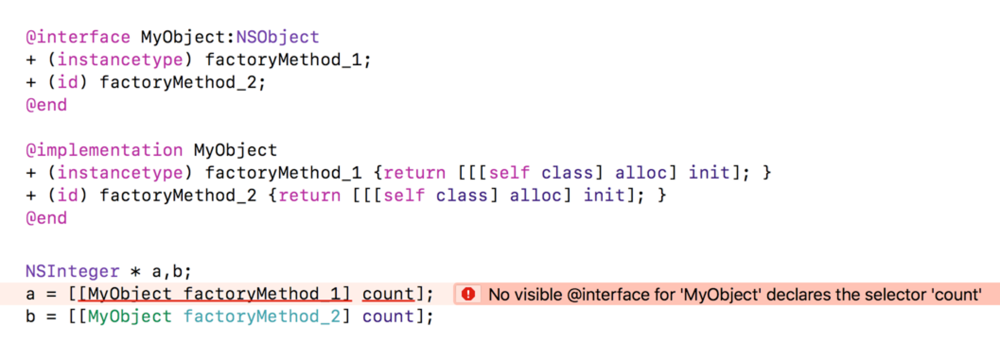

> id类型：所有的对象都可以是id类型的，只在运行时才会确定具体类型
>
> 为什么要用instancetype替换id

---

### id

id数据类型可以存储任何类型的对象，他是多态和动态绑定的基础，在出现instancetype之前，alloc、init以及很多的类方法都是返回的id类型。

### instancetype

这是clang新加入的关键字，使用`instancetype`关键字作为返回它们被调用的类的实例（或该类的子类）的方法的返回类型，这些方法包括`alloc`，`init`和一些类工厂方法。

### diffs

当使用`id`时基本上没有类型检查，而使用instancetype，编译器、IDE知道是什么类型的返回值，并能更好地在编译器发现一些问题的存在。

在适当的地方使用`instancetype`而不是`id`在可以提高类型安全性：

上面的代码可以展示出来，在**编译期间使用instancetype就会将错误报出来，而使用id的要到运行时才会报错，严重的还会引起crash**。

当使用一个方法进行返回id类型的数据的时候，考虑一下，**该返回值是不是当前类的实例，如果是的话，就使用instancetype，如果不是的话，就是用id类型来表示通用类型**。当然，一般来说，id类型会结合着协议来做一些不针对具体类的编程，让api不用受到业务方的限制。

另外还有一点是，`instancetype`不像`id`，**instancetype只能用作方法声明中的结果类型，不可以用作参数**。

---

https://www.cnblogs.com/rossoneri/p/5100530.html

https://developer.apple.com/library/content/releasenotes/ObjectiveC/ModernizationObjC/AdoptingModernObjective-C/AdoptingModernObjective-C.html#/apple_ref/doc/uid/TP40014150-CH1-SW8

http://nshipster.com/instancetype/

https://stackoverflow.com/questions/8972221/would-it-be-beneficial-to-begin-using-instancetype-instead-of-id

https://developer.apple.com/library/content/documentation/General/Conceptual/CocoaEncyclopedia/Initialization/Initialization.html#//apple_ref/doc/uid/TP40010810-CH6