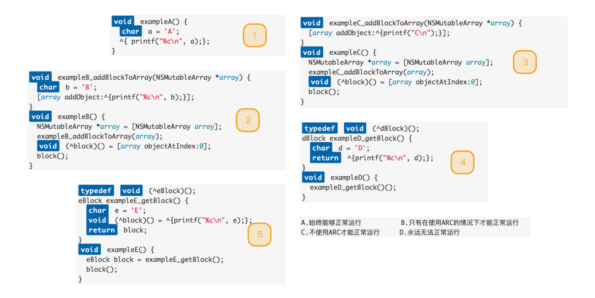

> 下面几道题目的答案是什么
>
> block捕获变量的实质是什么
>
> block在堆区和栈区的区别

---

### 面试题

关于block的几道面试题：

### 截获变量的瞬时值

### 

### BlocksKit

// todo BlocksKit的内部实现

---

https://blog.csdn.net/majiakun1/article/details/38304363

https://blog.csdn.net/roger_jin/article/details/45509667

https://blog.csdn.net/qq_30513483/article/details/52587551

https://github.com/BlocksKit/BlocksKit