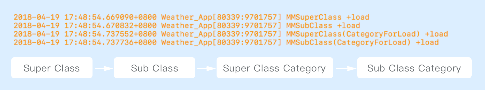

> +load的作用
>
> +load的加载时机：程序启动起来的时候根据继承链向下依次调用
>
> +initialze的加载时机：当前类第一次调用相关方法的时候

---
### 初始化操作

有时候类必须先执行某些初始化操作，然后才可以正常使用，一般可以通过`+load`和`+initialize`这两个方法来实现。

### [+load](https://developer.apple.com/documentation/objectivec/nsobject/1418815-load?preferredLanguage=occ)

这个方法对每一个加入到运行时系统中的类以及分类来说，都会调用，**调用时机是应用启动的时候，且是在main函数之前，只调用一次**。

对于类和分类来说，他们之间的调用顺序为（这里有一个特殊点是多个分类中都实现了+load方法，那么他们之间的调用顺序是不确定的）:

+load方法是没有遵循继承那一套逻辑的：1️⃣当前类没有实现+load方法，那就永远不会调用，即使它的父类实现了，也不会去调用调用父类的load方法；2️⃣即使分类和本类都实现了load方法，两个地方都会调用。

由于+load是在程序运行起来的时候调用的，这个时候的运行期系统处于一种不安全的状态，因此里面的方法应该尽量的精简，不要有复杂的逻辑以及等待锁等。并且，这个方法内部不要去使用其他的类来做事情，因为不确定那个被使用的类是否已经调用过+load方法。

目前在+load方法中常做的操作就是method swizzling，对于优化启动速度来说，load方法是一个优化方向。

### [+initialize](https://developer.apple.com/documentation/objectivec/nsobject/1418639-initialize?language=objc)

initialize在类或者其子类的**第一个方法被调用前调用**。即使类文件被引用进项目，但是没有使用，initialize不会被调用。

+initialize方法遵循继承的逻辑，即如果父类（本类或者分类都可以）实现了这个方法自己却没有实现，子类在第一次使用的时候会调用父类的方法；另外，如果本类和分类中都重写了该方法，那么分类中的会覆盖本类中的实现，这也正是由于它遵循继承的逻辑。

### diffs

上面提到load不遵循继承的一套逻辑，initialize遵循继承的逻辑，[使用runtime查看源码](https://www.jianshu.com/p/872447c6dc3f)可以知道：

*  `load` 方法的本质，是**直接执行函数指针**，因此 `load` 方法不会执行 `objc_msgSend` 的那一整套流程
*  `initialize` 最终是通过 `objc_msgSend` 来执行的，即 `initialize` 是会经过一系列方法查找来执行

|              | +load                  | +initialize      |
| ------------ | ---------------------- | ---------------- |
| 调用时机         | 被添加到 runtime 时，main函数前 | 收到第一条消息前，可能永远不调用 |
| 调用顺序         | 父类->子类->分类             | 父类->子类           |
| 调用次数         | 1次                     | 多次/1次/0次         |
| 是否需要显式调用父类实现 | 否                      | 否                |
| 是否沿用父类的实现    | 否                      | 是                |
| 分类中的实现       | 类和分类都执行                | 覆盖类中的方法，只执行分类的实现 |

---

https://developer.apple.com/documentation/objectivec/nsobject/1418815-load?preferredLanguage=occ

https://developer.apple.com/documentation/objectivec/nsobject/1418639-initialize?language=objc

https://www.jianshu.com/p/c52d0b6ee5e9

https://www.jianshu.com/p/872447c6dc3f

https://blog.csdn.net/qq_31810357/article/details/70622276

http://blog.leichunfeng.com/blog/2015/05/02/objective-c-plus-load-vs-plus-initialize/

https://stackoverflow.com/questions/13326435/nsobject-load-and-initialize-what-do-they-do