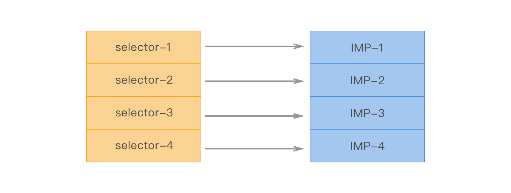
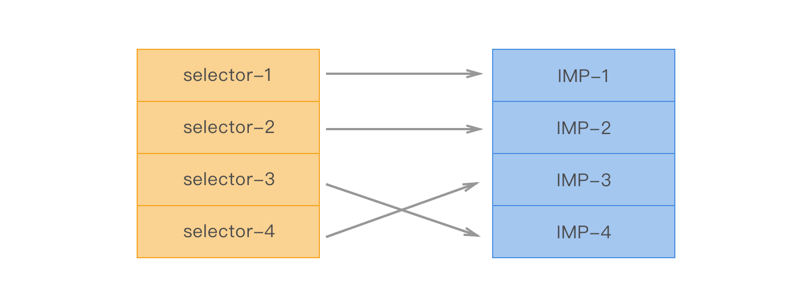

> selector和IMP的关系：一一对应的关系，两者组成了具体的方法内容
>
> swizzling的原理：修改了SEL对应的IMP

---

### 方法列表

通过查看`<objc/runtime.h>`头文件可以发现，类的原型为一个结构体：

```c
struct objc_class {
    Class _Nonnull isa  OBJC_ISA_AVAILABILITY;

#if !__OBJC2__
    Class _Nullable super_class                              OBJC2_UNAVAILABLE;
    const char * _Nonnull name                               OBJC2_UNAVAILABLE;
    long version                                             OBJC2_UNAVAILABLE;
    long info                                                OBJC2_UNAVAILABLE;
    long instance_size                                       OBJC2_UNAVAILABLE;
    struct objc_ivar_list * _Nullable ivars                  OBJC2_UNAVAILABLE;
    struct objc_method_list * _Nullable * _Nullable methodLists                    OBJC2_UNAVAILABLE;
    struct objc_cache * _Nonnull cache                       OBJC2_UNAVAILABLE;
    struct objc_protocol_list * _Nullable protocols          OBJC2_UNAVAILABLE;
#endif

} OBJC2_UNAVAILABLE;
```

其中比较关心的一个属性是`    struct objc_method_list ** methodLists`，这个就是方法列表，这个方法列表包含**类方法**以及**实例方法**，objc_method_list的原型为:

```c
struct objc_method_list {
    struct objc_method_list * _Nullable obsolete             OBJC2_UNAVAILABLE;

    int method_count                                         OBJC2_UNAVAILABLE;
#ifdef __LP64__
    int space                                                OBJC2_UNAVAILABLE;
#endif
    /* variable length structure */
    struct objc_method method_list[1]                        OBJC2_UNAVAILABLE;
}                                                            OBJC2_UNAVAILABLE;

struct objc_method {
    SEL _Nonnull method_name                                 OBJC2_UNAVAILABLE;
    char * _Nullable method_types                            OBJC2_UNAVAILABLE;
    IMP _Nonnull method_imp                                  OBJC2_UNAVAILABLE;
}                                                            OBJC2_UNAVAILABLE;

typedef struct objc_method *Method;
typedef struct objc_selector *SEL;
id (*IMP)(id, SEL, ...);
```

到这里终于看到了SEL和IMP，以及将他们组合起来的**Method**，Method记录着方法的名词、参数和实现，通过`Method * class_copyMethodList(Class _Nullable cls, unsigned int * _Nullable outCount) `方法可以获取类的所有方法（不论是实例方法还是类方法）。

这里SEL和IMP是一一对应的关系，在头文件中还存在一些方法可以通过SEL来获取对应的IMP：`IMP class_getMethodImplementation(Class cls, SEL name);`，第一个参数通过传递不同类型可以用来获取实例方法（`objc_getMetaClass("YourClassName")`）以及类方法（`[YourClassName class]`）。

另外，NSObject类也提供了一个方法可以通过SEL来获取IMP：`-(IMP)methodForSelector:(SEL)aSelector;`和`+(IMP)instanceMethodForSelector:(SEL)aSelector;`，分别对应实例方法和类方法。


### 对应关系

SEL就是`@selector(methodName)`进行转化过后的产物，IMP有点类似函数指针，指向具体的Method实现，他们两个合起来可以代表具体的一个方法的名称以及实现，并且他们在方法列表中是呈现一一对应的关系：




### swizzling

在runtime中，调用方法最后的结果是使用`objc_msgSend(receiver, selector, arg1, arg2, ...)`进行消息的发送，即通过SEL在方法列表中找到对应的方法地址，也就是IMP，然后实现对应的方法。

在runtime头文件中有以下方法可以改变SEL对应的IMP：

*  method_exchangeImplementations 来交换2个方法中的IMP
*  class_replaceMethod 来修改类
*  method_setImplementation 来直接设置某个方法的IMP

原理都是**修改了SEL对应的IMP**：



具体的代码为：

```objective-c
#import "NSArray+Swizzle.h"    
@implementation NSArray (Swizzle)  
- (id)myLastObject  
{  
    id ret = [self myLastObject];  
    NSLog(@"hook get last object %@",ret); 
    return ret;  
}  
@end 

Method ori_Method =  class_getInstanceMethod([NSArray class], @selector(lastObject));  
Method my_Method = class_getInstanceMethod([NSArray class], @selector(myLastObject));  
method_exchangeImplementations(ori_Method, my_Method);  

NSArray *array = @[@"0",@"1",@"2",@"3"];  
NSString *string = [array lastObject];  
NSLog(@"TEST RESULT : %@",string);  
```

**多个有继承关系的类都进行了swizzling，那么会先从父对象开始**， 这样才能保证子类方法拿到父类中的被swizzle的实现。另外，将所有的swizzling操作都放在+(void)load中，除了+load方法在启动的时候只执行一次，还有load类方法会默认从父类开始调用的因素在。