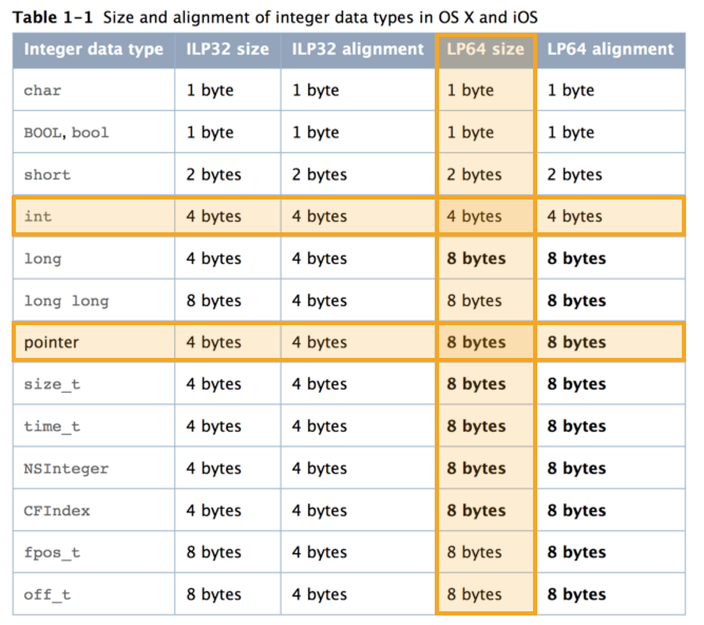
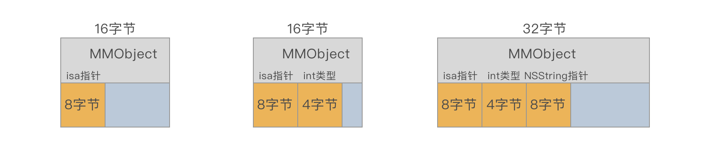
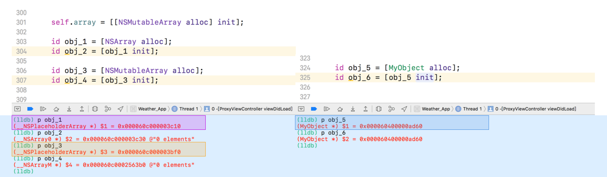

> alloc和init的含义
>
> alloc和init的作用

---

### alloc

在初始化对象的时候，一般的操作都是进行alloc-init，或者使用两者的结合方法 new。

```objective-c
MMObject * obj = [MMObject alloc]；
```

alloc，它初始化新对象的isa实例变量指向类的数据结构，也就是分配了一块内存给对象，并且把地址返回给指针`*obj`，然后后续的操作可以使用这一块内存进行初始化（比如各种init方法）对应的对象。

既然是申请分配内存，那么分配的内存有多大呢？使用`malloc_size`来查看alloc之后的内存大小（iPhone6 机型下，64位系统）：

```objective-c
- (void)touchesBegan:(NSSet<UITouch *> *)touches withEvent:(UIEvent *)event{
    [super touchesBegan:touches withEvent:event];
    for (int i = 0; i < 1; i ++) {
        
        MMObject * obj = [MMObject alloc];
    NSLog(@"Size of MMObject: %zd", malloc_size((__bridge const void *) obj));
      // 返回的结果为16个字节
    }
}
```

一个空白类alloc之后竟然有16字节大小，再添加一个int类型的属性，看一下：

```objective-c
@interface MMObject : NSObject{
    int age;
}
@end
```

会发现，还是16字节，竟然和空白类的内存大小是一样的。那么再添加一个NSString类型的属性：

```objective-c
@interface MMObject : NSObject{
    int age;
    NSString * name;
}
@end
```

会发现，这时候变成了32字节大小。

这其中的原因为：每一个继承至NSObject的类中都是有一个`isa`指针，根据[文档中的列举](https://developer.apple.com/library/content/documentation/General/Conceptual/CocoaTouch64BitGuide/Major64-BitChanges/Major64-BitChanges.html#//apple_ref/doc/uid/TP40013501-CH2-TPXREF103)可以看出来：

* 一开始的没有属性的MMObject，默认申请的内存大小应该为 8字节
* 有一个int类型的属性之后，申请的内存大小应该为 8字节+4字节 = 12字节
* 最后又添加了一个NSString类型属性之后，大小应该为  8字节+8字节+4字节 = 20字节

但是，每次按照下表的内存大小相加结果都和实际的内存大小都不一致。这其中的偏差要涉及到一个叫做字节对齐的概念。




### 字节对齐

根据[文档上](https://developer.apple.com/library/content/documentation/Performance/Conceptual/ManagingMemory/Articles/MemoryAlloc.html#//apple_ref/doc/uid/20001881-99117)的解释，在分配任何小块内存时，内存块的粒度都是16个字节。因此，分配到的最小内存块为16个字节，并且任何大于该值的块都是16的倍数。这也就是为什么上面依次出现的是16字节、16字节、32字节，而不是8字节、12字节、20字节。



### 类簇

类簇是一种设计模式，比如如NSString、NSArray、NSDictionary以及NSNumber都运作在这一模式下，它是接口简单性和扩展性的权衡体现，在我们完全不知情的情况下，偷偷隐藏了很多具体的实现类，只暴露出简单的接口。

虽然`init...`方法是他们的方法签名所要求的返回一个对象，该对象不一定是最近分配的对象 - `init...`消息的接收者。换句话说，你从初始化器获得的对象可能不是你想要初始化的对象：




---

https://developer.apple.com/library/content/documentation/General/Conceptual/CocoaTouch64BitGuide/Major64-BitChanges/Major64-BitChanges.html#//apple_ref/doc/uid/TP40013501-CH2-TPXREF103

https://developer.apple.com/library/ios/documentation/general/conceptual/CocoaEncyclopedia/ClassClusters/ClassClusters.html

http://www.cocoachina.com/ios/20160627/16823.html