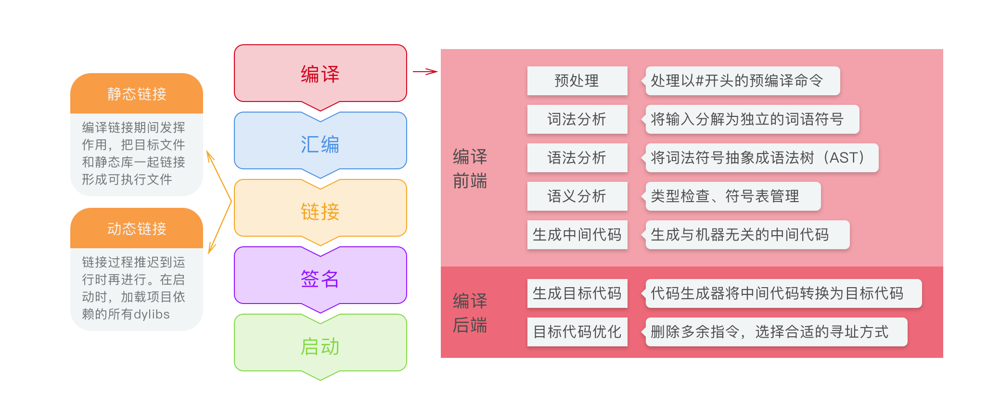

> 当点击编译器的run之后进行了什么：App 进行编译、汇编、链接、代码签名以及启动执行等操作
>
> 也可以当做`从代码到软件界面出现，这之间经过了什么步骤`

---

### Run

在代码运行成软件之前，要经过一系列的过程，如下图：

### 编译

编译主要依赖编译器来完成一系列的操作，主要有上图中的**编译前端**和**编译后端**两部分中的几个处理。目前OS X使用的编译器是LLVM，其中编译前端使用的是常听说的clang，主要负责生成与机器无关的中间代码，编译后端使用的是llvm，负责将中间代码转化成优化过的目标机器代码。

### 链接

链接又分为**静态链接**和**动态链接**：

* 静态链接主要将多个目标文件和静态库合并成一个可执行文件（Mach-O形式）；
* 而动态链接是将链接时间放到了启动之后，也就是运行时，将系统中所有的动态链接库(dylib)进行链接。

使用动态链接可以减少启动时间，对于共享同一份代码（系统的framework）来说，减少了磁盘上多次的拷贝。

### 启动

上面所有的流程之后，会形成一个可以行程序，然后就需要将他启动运行，启动中主要的操作都是dyld(动态链接器)进行**动态链接**、进行**符号和地址的绑定**等操作。

具体的操作列举如下：

* 加载所依赖的`dylibs`
* `Fix-ups：Rebase`修正地址偏移，因为 `OS X`和 `iOS`搞了一个叫 `ASLR`的东西来做地址偏移（随机化）来避免收到攻击
* `Fix-ups：Binding`确定 `Non-Lazy Pointer`地址，进行符号地址绑定。
* `ObjC runtime`初始化：加载所有类
* `Initializers：`执行`load`方法和`__attribute__((constructor))`修饰的函数

---

https://www.jianshu.com/p/d5cf01424e92

https://ming1016.github.io/2017/03/01/deeply-analyse-llvm/