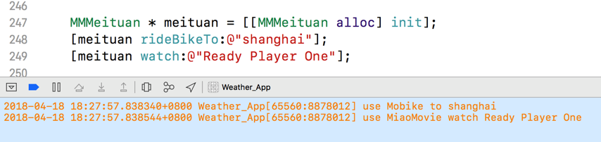

> 多继承的实质：一个子类可以有多个父类
>
> Cocoa中实现多继承的方法：使用NSProxy结合消息转发机制来模拟

---

### 多继承

多继承即一个子类可以有多个父类，它继承了多个父类的特性。多继承在编程中是一个很重要的特性，但是在Cocoa开发中，是不支持多继承的，不过这不代表不可以使用这一个特性。在Cocoa开发中，可以使用一些手段来模拟出多继承的功能，虽然本质上还是没有多继承，使用的核心就是使用NSProxy作为消息转发的代理类。


### NSProxy

通过NSProxy的头文件可以看出来，`NSProxy`除了准守 \<NSObject\> 协议、重载消息转发机制外没有别的用法，这也是它被设计的初衷，自己什么都不干，将方法转给代理对象去做。


### 在Cocoa中模拟多继承

一个实际使用场景：摩拜单车和猫眼电影，使用摩拜单车去一个电影院用猫眼电影买票看电影。就需要使用两个app来完成这个步骤：骑车、看电影，如果这时候想在一个app内部完成这个流程该怎么做呢？现实中可以有美团收购摩拜单车，让猫眼电影和摩拜单车在美团App内部完成两者所有的相关业务，在编程中，就需要使用多继承的思想来完成这个操作。

先构建两个类，来代表摩拜单车和猫眼电影，需要注意的是，他们的业务逻辑都是使用协议来声明的，这是模拟多继承的基础操作，可以让两者的“共有子类”可以通过遵守协议来完成相应的业务逻辑：

```objective-c
@protocol MMMobike <NSObject>
- (void) rideBikeTo:(NSString *)destination;
@end

@interface MMMobike : NSObject<MMMobike>
@end

@implementation MMMobike
- (void) rideBikeTo:(NSString *)destination{
    NSLog(@"use Mobike to %@",destination);
}
@end

@protocol MMMiaoMovie <NSObject>
- (void) watch:(NSString *)movie;
@end

@interface MMMiaoMovie : NSObject<MMMiaoMovie>
@end

@implementation MMMiaoMovie
- (void) watch:(NSString *)movie{
    NSLog(@"use MiaoMovie watch %@",movie);
}
@end
```

然后声明一个“共有子类”，这里使用美团app来模拟这个角色：

```objective-c
@interface MMMeituan : NSProxy<MMMiaoMovie,MMMobike>{
    MMMiaoMovie * _miaoMovie;
    MMMobike * _mobike;
    NSMutableDictionary * _methodsMap;
}
@end
```

它内部的实现逻辑为：

* 使用一个字典来将父类们的方法进行对应的保存（方法为key、父类为value）
* 在消息转发机制中根据不同的SEL来找到真正的父类，完成消息的转发

```objective-c
- (instancetype)init{
    _methodsMap = [NSMutableDictionary dictionary];
    _miaoMovie = [[MMMiaoMovie alloc] init];
    _mobike = [[MMMobike alloc] init];
    
    //映射target及其对应方法名
    [self mm_registMethodsWithTarget:_miaoMovie];
    [self mm_registMethodsWithTarget:_mobike];
    
    return self;
}

- (void) mm_registMethodsWithTarget:(id)target{
    
    unsigned int numberOfMethods = 0;
    
    //获取target的所有方法列表，因为target都遵守了对应的协议，实现了对应的方法，所以这里可以获取到这些Method
    Method *method_list = class_copyMethodList([target class], &numberOfMethods);
    
    for (int i = 0; i < numberOfMethods; i ++) {
        //获取方法名
        Method temp_method = method_list[i];
        SEL temp_sel = method_getName(temp_method);
        const char *temp_method_name = sel_getName(temp_sel);
        // 将方法名称作为 key ，目标对象作为 value 使用字典进行存储
        [_methodsMap setObject:target forKey:[NSString stringWithUTF8String:temp_method_name]];
    }
    
    free(method_list);
}

#pragma mark - 消息转发机制

- (NSMethodSignature *)methodSignatureForSelector:(SEL)sel{
    //获取选择子方法名，由于本类遵守了两个协议，所以这里返回的是：rideBikeTo: 和eat:
    NSString *methodName = NSStringFromSelector(sel);
    
    //在字典中查找对应的target
    id target = _methodsMap[methodName];
    
    //检查target
    if (target && [target respondsToSelector:sel]) {
        return [target methodSignatureForSelector:sel];
    } else {
        return [super methodSignatureForSelector:sel];
    }
}

- (void)forwardInvocation:(NSInvocation *)invocation{
    //获取当前选择子
    SEL sel = invocation.selector;
    
    //获取选择子方法名
    NSString *methodName = NSStringFromSelector(sel);
    
    //在字典中查找对应的target
    id target = _methodsMap[methodName];
    
    //检查target
    if (target && [target respondsToSelector:sel]) {
        [invocation invokeWithTarget:target];
    } else {
        [super forwardInvocation:invocation];
    }
}
@end
```

自此，一个模拟的多继承就完成了，具体的操作日志：




### other

毕竟在消息转发的流程中，进入完备的消息转发阶段的消耗是比较大的，当可以在前期（方法查找、备援接收者）进行转发，最好在前期进行，也就是下图中的第二个方法内部进行处理：


// todo 在备援接收者内部处理实现多继承


### 菱形缺陷

多继承看起来很完美，可以避免重复，可以将不同功能集中化。但是多继承有一个无法回避的问题，就是**两个父类都实现了同样的方法时，子类该怎么办**？我们很难确定应该继承哪一个父类的方法。因为多继承的拓扑结构是一个菱形，所以这个问题又被叫做菱形缺陷 (Diamond Problem)。像是 C++ 这样的语言选择粗暴地将菱形缺陷的问题交给程序员处理，这无疑非常复杂，并且增加了人为错误的可能性。而绝大多数现代语言对多继承这个特性选择避而远之，这也是Objective-C中不支持多继承的原因之一。


---

http://ios.jobbole.com/87856/

http://blog.sunnyxx.com/2014/08/24/objc-duck/

http://blog.sunnyxx.com/2014/08/26/objc-duck-advanced/