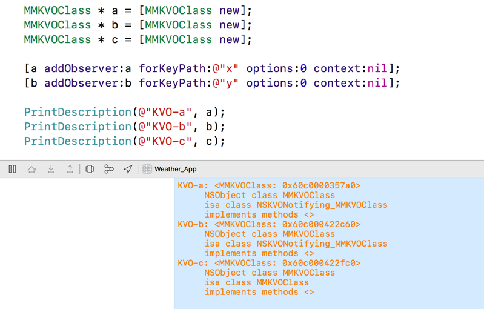

> KVO的实现方式：**使用runtime动态生成类**并重写setter方法，在修改的时候传递状态
>
> 优秀的第三方KVO实现：KVOController

---

### KVO

KVO 是 Objective-C 对观察者模式（Observer Pattern）的实现。当被观察对象的某个属性发生更改时，观察者对象会获得通知。它的内部实现依赖于 Objective-C 的 Runtime 机制（主要是动态创建类）。


### 内部实现

通过文档可以模糊的知道：在对一个对象进行观察的时候，会动态的创建一个中间类（这个类**继承**至被观察对象的原本类），中间类重写了被观察属性的`setter`方法，然后将`被观察的对象的isa指针指向这个中间类`，这样被观察的对象就成为了中间类的实例，在被重写的`setter`方法中，中间类会将改变前、改变后的值通知所有观察对象值的更改。

使用代码查证：

```objective-c
@interface MMKVOClass : NSObject{
    int x;
    int y;
    int z;
}
@property int x;
@property int y;
@property int z;
@end
@implementation MMKVOClass
@synthesize x, y, z;
@end
  
// 获取类实现了哪些方法
static NSArray *ClassMethodNames(Class c)
{
    NSMutableArray *array = [NSMutableArray array];
    
    unsigned int methodCount = 0;
    Method *methodList = class_copyMethodList(c, &methodCount);
    unsigned int i;
    for(i = 0; i < methodCount; i++)
        [array addObject: NSStringFromSelector(method_getName(methodList[i]))];
    free(methodList);
    
    return array;
}

// 对实例对象的一些属性进行组合输出log
static void PrintDescription(NSString *name, id obj)
{
    
    // 获取实例对象的isa类型，也就是元类
    const char *className = object_getClassName(obj);
    Class metaClass = objc_getMetaClass(className);
    
    // 分别打印:
    // 附加信息-name
    // 实例的地址-obj
    // 实例的类名-class_getName([obj class])
    // 实例的isa类名-class_getName(metaClass)
    // 实例的isa实现的方法-[ClassMethodNames(metaClass) componentsJoine...
    NSString *str = [NSString stringWithFormat:
                     @"%@: %@\n\tNSObject class %s\n\tisa class %s\n\timplements methods <%@>",
                     name,
                     obj,
                     class_getName([obj class]),
//                     class_getName(obj->isa),// 现在已经获取不到isa指针了
                     class_getName(metaClass),
                     [ClassMethodNames(metaClass) componentsJoinedByString:@", "]];
    printf("%s\n", [str UTF8String]);
}

// in main()
MMKVOClass * a = [MMKVOClass new];
MMKVOClass * b = [MMKVOClass new];
MMKVOClass * c = [MMKVOClass new];

[a addObserver:a forKeyPath:@"x" options:0 context:nil];
[b addObserver:b forKeyPath:@"y" options:0 context:nil];

PrintDescription(@"KVO-a", a);
PrintDescription(@"KVO-b", b);
PrintDescription(@"KVO-c", c);
```



现在由于不可以获取到isa指针，导致生成的中间类具体实现了哪些方法看不到，不过通过[以往的探索博文](https://www.mikeash.com/pyblog/friday-qa-2009-01-23.html)可以看出来，中间类重写了class、dealloc、被观察的属性的setter方法（没有被观察的不会重写setter方法）以及一个奇怪的_isKVOA方法。

* 重写setter方法是为了将改变前后的值传递出去
* 重写class方法是为了迷惑使用者，告诉使用者这个类没有改变，还是原来的类，但是metaClass已经揭穿了它的谎言
* 重写dealloc应该是为了将这种绑定关系在销毁的时候移除掉
* _isKVOA这个私有方法应该就是内部处理消息传递的逻辑处理部分


### KVOController

// todo 解读内部源码


---

http://tech.glowing.com/cn/implement-kvo/

https://www.mikeash.com/pyblog/friday-qa-2009-01-23.html

https://developer.apple.com/library/content/documentation/Cocoa/Conceptual/KeyValueObserving/Articles/KVOImplementation.html

https://github.com/facebook/KVOController

https://github.com/Draveness/Analyze/blob/master/contents/KVOController/KVOController.md
