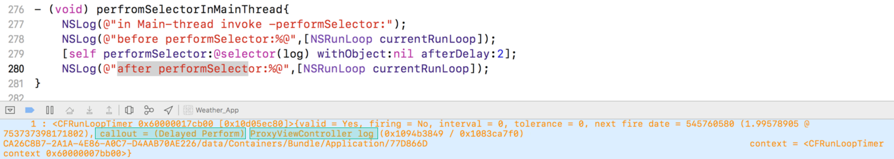

> NSObject有几种`perfromSelector`方法
>
> 这几种`perfromSelector`方法的实质都是什么，之间的区别是什么
>
> performSelector方法在不同线程中的使用注意事项

---

### perfromSelector方法

NSObject的分类提供了以下performSelector方法:

#### 1.NSObject协议

这些方法等同于直接根据SEL调用方法，原理和这里要讨论的问题无关，放到这里是为了内容的完整性。


#### 2.NSObject延迟执行分类

这部分的方法本质上是和runloop有关的，执行这些方法本质上是**通过创建一个NSTimer然后加入到当前线程中**，可以设置对应的mode。

这部分还有几个`+cancelPreviousPerformSelector`方法，他们的作用是**取消当前runloop中target注册的SEL**。


#### 3.NSObject线程执行分类

这部分的执行方法是根据不同的线程，以及对应线程的runloop执行对应的SEL，可以看做是线程和runloop的结合，是第2种情况中没有考虑线程问题的补充。


### runloop和thread

上面说了，延迟执行方法，其实就是在当前runloop中加入了一个NSTimer，通过代码验证一下：

```objective-c
- (void) viewDidLoad{
    [self perfromSelectorInMainThread];
}
- (void) perfromSelectorInMainThread{
    NSLog(@"in Main-thread invoke -performSelector:");
    NSLog(@"before performSelector:%@",[NSRunLoop currentRunLoop]);
    [self performSelector:@selector(log) withObject:nil afterDelay:2];
    NSLog(@"after performSelector:%@",[NSRunLoop currentRunLoop]);
}
- (void) log{
    NSLog(@"this is a log after 2s later...");
}
```

根据执行前后两次log可以看出来，确实是在执行之后runloop中多了一个`CFRunLoopTimer`，而NSTimer本质上就是对CFRunLoopTimer的封装，因此可以确定的是：**执行延迟方法是在当前runloop中加入了一个NSTimer**。



上面的例子是在main-thread中进行的延迟执行，如果是非main-thread，又是怎么样的一个效果呢，这里使用NSThread来模拟非main-thread：

```objective-c
- (void) viewDidLoad{
    self.thread1 = [[NSThread alloc] initWithTarget:self selector:@selector(perfromSelectorInUnMainThread) object:nil];
    [self.thread1 start];
}

- (void) perfromSelectorInUnMainThread{
    NSLog(@"in unMain-thread invoke -performSelector:");
    NSLog(@"before performSelector:%@",[NSRunLoop currentRunLoop]);
    [self performSelector:@selector(log) withObject:nil afterDelay:2];
    NSLog(@"after performSelector:%@",[NSRunLoop currentRunLoop]);
}
- (void) log{
  // ...
}
```

通过日志可以看出来，确实是为当前线程添加了一个NSTimer，不过这里的currentRunLoop却比较简单，因为这个是当前thread1线程的runloop，非main-thread的runloop。

虽然是添加了一个NSTimer，但是2s过后，log方法并没有被执行输出，这是因为，在**非main-thread中的runloop不会自动运行，需要手动执行run方法**，这一点和上面`NSObject协议中的那些performSelector`的不同就体现出来了，无论是在main-thread还是非mainth-thread上，他们都相当于直接调用，而涉及到`延迟调用的这些performSelector方法`，在非main-thread中需要手动运行runloop：

```objective-c
- (void) perfromSelectorInUnMainThread{
    NSLog(@"in unMain-thread invoke -performSelector:");
    NSLog(@"before performSelector:%@",[NSRunLoop currentRunLoop]);
    [self performSelector:@selector(log) withObject:nil afterDelay:2];
    //[[NSRunLoop currentRunLoop] run];// run-1
    NSLog(@"after performSelector:%@",[NSRunLoop currentRunLoop]);
    //[[NSRunLoop currentRunLoop] run];// run-2
}
```

上面的run-1和run-2方法都可以运行当前runloop，区别是：

* 1️⃣如果在run-1处运行，那么最后一个NSLog(@"after….")要在控制器的log方法执行完成之后才会打印（也就是当前runloop执行完成之后）；
* 2️⃣如果是在run-2处运行，那么会紧接着NSLog(@"before...")一起打印，而不用等到2s以后。

这个就是因为：**runloop其实是一个while(1)的循环，内部不break，他就会一直执行，导致后面的代码执行不到**。


### \<NSObject\>：performSelector

在\<NSObject\>协议中的那几个performSelector方法虽然提高了编程的灵活性，由于Object-C是一门动态语言，要处理的方法只有到运行时才能确定，编译器不知道将要调用的选择子是什么，因此，也就不了解其方法签名以及返回值，甚至连是否有返回值不清楚。由于编译器不知道方法名，也就没办法运用ARC的内存管理规则来判断返回值是不是应该释放，因此，ARC的做法就是不添加释放操作，但是这样**可能会导致内存泄露**，因为方法在返回对象时可能已经将其保留了，具体这种情况的讨论可以参考[so上的这个问题](https://stackoverflow.com/questions/7017281/performselector-may-cause-a-leak-because-its-selector-is-unknown)。

另外，这些方法由于只支持对象参数，像一些基本类型的（BOOL、int、double等）需要包装成NSNumber类型，甚至NSValue类型进行传递，这在debug模式下是没有问题的，但是在release模式下打包会出现类型传递错误。除了这些，在编译时期，编译器还会有一些⚠️，避免警告的方法是使用一些clang指令，结合宏可以将他们进行简化：

```objective-c
#pragma clang diagnostic push
#pragma clang diagnostic ignored "-Warc-performSelector-leaks"
    [self.ticketTarget performSelector: self.ticketAction withObject: self];
#pragma clang diagnostic pop

#define SuppressPerformSelectorLeakWarning(Stuff) \
    do { \
        _Pragma("clang diagnostic push") \
        _Pragma("clang diagnostic ignored \"-Warc-performSelector-leaks\"") \
        Stuff; \
        _Pragma("clang diagnostic pop") \
    } while (0)
```

一个在Apple的开发语言的发展中涉及到该方法的信息是：在一开始添加这个方法的时候还没有ARC的概念，调用它是没有任何问题的，但是到了加入ARC这项功能，编译器就会报错，以上说的是使用Objective-C语言，而在swift中，[文档中](https://developer.apple.com/library/prerelease/ios/documentation/Swift/Conceptual/BuildingCocoaApps/InteractingWithObjective-CAPIs.html#//apple_ref/doc/uid/TP40014216-CH4-XID_38)直接指明这个方法是''inherently unsafe"的，并且不允许调用这个方法。


### objc_msgSend

当一个对象使用performSelector调用方法的时候，内部大概的实现是这样的：

```objective-c
[_controller performSelector:NSSelectorFromString(@"someMethod")];

//-- 模拟 performSelector 内部的实现
if (!_controller) { return; }
SEL selector = NSSelectorFromString(@"someMethod");
IMP imp = [_controller methodForSelector:selector];
void (*func)(id, SEL) = (void *)imp;
func(_controller, selector);

//-- 简化版
SEL selector = NSSelectorFromString(@"someMethod");
((void (*)(id, SEL))[_controller methodForSelector:selector])(_controller, selector);
```

其实就是runtime中的msgSend，也就是原始C风格的调用指针函数。那么如果这样调用会有不同么

```objective-c
objc_msgSend(_controller, NSSelectorFromString(@"someMethod"));
```

- Don't do that, `[_controller performSelector:NSSelectorFromString(@"someMethod")];` and `objc_msgSend(_controller, NSSelectorFromString(@"someMethod"));` are not equivalent! Have a look at [Method Signature Mismatches](http://www.mikeash.com/pyblog/friday-qa-2011-08-05-method-signature-mismatches.html) and [A big weakness in Objective-C's weak typing](http://cocoawithlove.com/2011/06/big-weakness-of-objective-c-weak-typing.html) they are explaining the problem in depth. – [0xced](https://stackoverflow.com/users/21698/0xced) Nov 16 '11 at 9:40
- @0xced In this case, it's fine. objc_msgSend will not create a method signature mismatch for any selector that would have worked correctly in performSelector: or its variants since they only ever take objects as parameters. As long as all your parameters are pointers (incl. objects), doubles and NSInteger/long, and your return type is void, pointer or long, then objc_msgSend will work correctly.这是第二个链接的作者的回答

----

