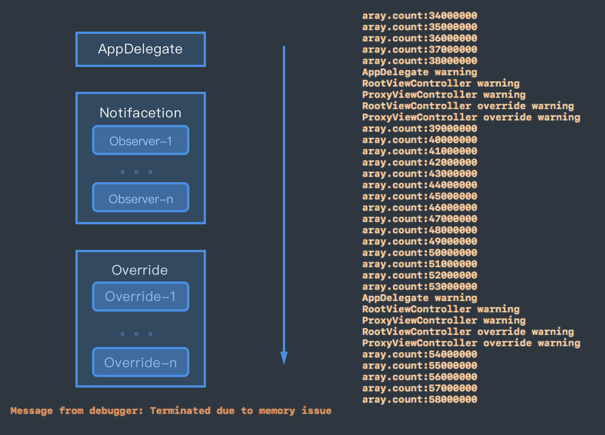

> didReceiveMemoryWarning在什么时候调用
>
> 在这个方法内部可以做什么、需要做什么

---

### 时机

在iOS中虚拟内存不足的时候，系统会尽可能的释放一些应用来缓解内存压力，当然也可能对正在运行的程序发送低内存通知。接收到通知的程序的时候要进行有计划的内存释放、数据保存等操作，因为有可能会被系统终止（处于后台但活跃的程序）来缓解压力，即使是处于前台的程序也有可能会被终止，比如发生了内存泄露或者消耗了太多的内存。

UIKit提供了几种接收低内存通知的方法：

* UIAppDelegate实现的的`applicationDidReceiveMemoryWarning:`委托方法
* 重写自定义UIViewController子类中的`didReceiveMemoryWarning`方法
* 注册名为`UIApplicationDidReceiveMemoryWarningNotification`的通知


### 顺序

验证一下这三个的执行顺序，通过在下面的三个类中依次实现下列方法(RootViewController push出ProxyViewController)：

```objective-c
// in AppDelegate
- (void)applicationDidReceiveMemoryWarning:(UIApplication *)application{
    NSLog(@"AppDelegate warning");
}

// in RootViewController
-(void) viewDidLoad{
    [[NSNotificationCenter defaultCenter] addObserver:self selector:@selector(mm_didReceiveMemoryWarning) name:UIApplicationDidReceiveMemoryWarningNotification object:nil];
}
- (void) mm_didReceiveMemoryWarning{
    NSLog(@"RootViewController warning");
}
- (void)didReceiveMemoryWarning{
    NSLog(@"RootViewController override warning");
}

// in ProxyViewController
-(void) viewDidLoad{
    [[NSNotificationCenter defaultCenter] addObserver:self selector:@selector(mm_didReceiveMemoryWarning) name:UIApplicationDidReceiveMemoryWarningNotification object:nil];
}
- (void) mm_didReceiveMemoryWarning{
    NSLog(@"ProxyViewController warning");
}
- (void)didReceiveMemoryWarning{
    NSLog(@"ProxyViewController override warning");
}
- (void)touchesBegan:(NSSet<UITouch *> *)touches withEvent:(UIEvent *)event {
    for (int i = 1000000; i > 0; i --) {
        [self.array addObject:[MMSuperClass new]];
    }
    NSLog(@"aray.count:%d",self.array.count);
}
```

对应的日志输出如下，在崩溃的时候内存已经达到了1.2G：


### UIViewController

~~当收到内存警告时，如果viewcontroller未显示（在后台），会执行didReceiveMemoryWarning -> viewDidUnLoad；如果viewcontroller当前正在显示（在前台），则只执行didReceiveMemoryWarning。~~ 
~~当程序进入前台，重新显示该viewController时，执行过viewDidUnLoad的viewcontroller（即原来在后台）会重新调用loadview -> viewDidLoad。~~

经过验证，没有进行这样的流程，目前的iOS11系统下，`viewDidUnLoad`函数已经被废弃了。


### 释放内存

在控制器收到内存警告的时候，控制器会自动删除当前屏幕以外的视图引用，而开发人员应该立即释放无关紧要的对象，究竟要释放哪些对象取决于具体项目中的侧重点。


----

https://developer.apple.com/library/content/documentation/Performance/Conceptual/ManagingMemory/Articles/MemoryAlloc.html#//apple_ref/doc/uid/20001881-SW1

https://blog.csdn.net/leikezhu1981/article/details/46440547