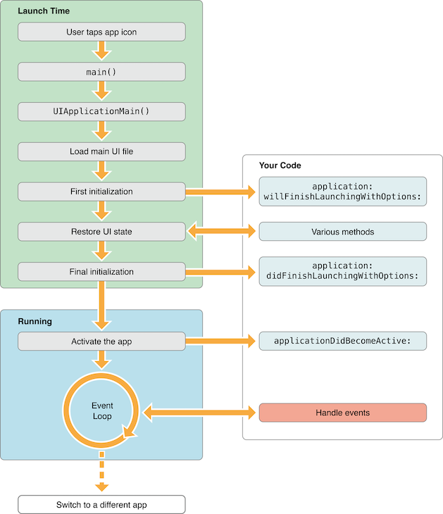
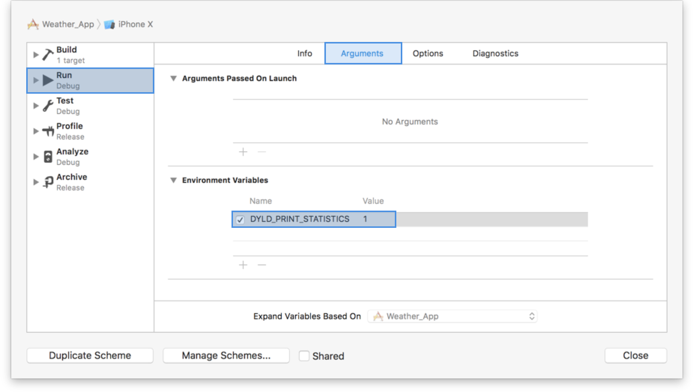

> 如何获取启动时间： t1(`main()`之前的加载时间) + t2(`main()`之后的加载时间)
>
> 怎样优化启动时间：内嵌的dylib尽可能少、移植load中的方法到initialize

---

### 启动时间

启动时间是才从点击icon到 `applicationWillFinishLaunching` 被调动这之间的等待时间，启动时间一旦超过 20s，系统会认为发生了死循环并杀掉 App 进程。

应用分为**冷启动**和**热启动**，这里关于优化的启动时间就是指冷启动状态下的时间：

* 冷启动是软件没有处于active状态，当点击icon软件从关闭到活跃起来
* 热启动是指应用处于后台（并没有被关闭，比如下拉状态栏，点击home键），或者从其他的软件切换过来



根据文档上的示例图，现在得出启动时间的公式：

t(App 总启动时间) = t1(`main()`之前的加载时间) + t2(`main()`之后的加载时间)


### pre-main

t1 = 系统的 dylib (动态链接库)和 App 可执行文件的加载时间

由于测量t1是很难用代码去实现的，不过既然是dyld在掌控启动前的操作，那么可以通多dyld的内建测量方法：在 Xcode 中 Edit scheme -> Run -> Auguments 将环境变量 `DYLD_PRINT_STATISTICS` 设为 `1`。



日志台就会输出main函数前的加载时间：

```objective-c
Total pre-main time: 1.0 seconds (100.0%)
         dylib loading time: 167.74 milliseconds (15.4%)
        rebase/binding time: 597.88 milliseconds (55.2%)
            ObjC setup time:  40.07 milliseconds (3.7%)
           initializer time: 277.23 milliseconds (25.5%)
           slowest intializers :
               libSystem.dylib :   4.36 milliseconds (0.4%)
   libBacktraceRecording.dylib :  38.27 milliseconds (3.5%)
                libc++.1.dylib :  62.87 milliseconds (5.8%)
    libMainThreadChecker.dylib :  68.48 milliseconds (6.3%)
                   Weather_App :  94.78 milliseconds (8.7%)
```


### after-main

t2 = `main`函数执行之后到 `AppDelegate` 类中的`applicationDidFinishLaunching:withOptions:`方法执行结束前这段时间

通过下面的方法可以获得到t2时间的大小：

```objective-c
CFAbsoluteTime StartTime;

int main(int argc, char * argv[]) {
    @autoreleasepool {
        StartTime = CFAbsoluteTimeGetCurrent();
        return UIApplicationMain(argc, argv, nil, NSStringFromClass([AppDelegate class]));
    }
}

extern CFAbsoluteTime StartTime;
 ...
 
// 在 applicationDidFinishLaunching:withOptions: 方法的最后统计
dispatch_async(dispatch_get_main_queue(), ^{
    NSLog(@"Launched in %f sec", CFAbsoluteTimeGetCurrent() - StartTime);
});
```


### 加载dylibs

加载动态链接库是一个很耗时的过程，相对于自定义的dylib，加载系统的则会很快，因为系统对这些有优化（会被预先计算和缓存起来）。针对于手动添加的dylib，可以将多个合成一个来加载，减少这之间发生的链接操作。或者可以不使用动态链接库，改为使用静态链接库，在编译时将文件打到包里，具体使用静态还是动态取决于具体开发中的衡量。


### load&initialize

为了在使用类前进行一些初始化，比如一些静态变量、swizzling，会选择使用load和initialize方法，但是load方法是在main函数之前（也就是启动之前）调用的，针对于每一个实现了该方法的类都会调用，无形中就增加了启动时间，一个合理的方式是将一些不必要的方法移到initialize中进行。

由于initialize遵循继承机制，因此在本类重写该方法的时候需要判断是当前类还是子类：

```objective-c
@implementation MMSuperClass

+ (void)initialize {
    if (self == [MMSuperClass class]) {
        // do whatever
    }
}
```


---

https://developer.apple.com/videos/play/wwdc2016/406/