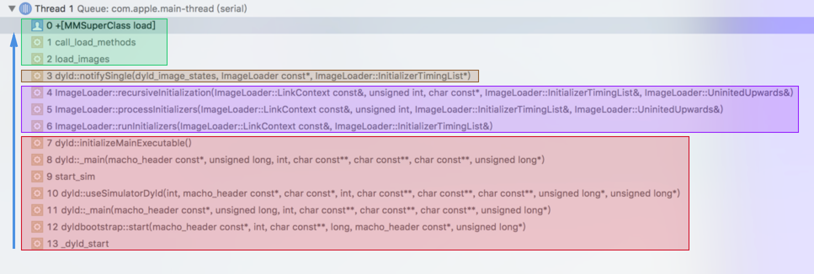

> 作为程序的入口，main函数是程序最开始操作的入口么
>
> 在main函数之前是否还有其他操作
>
> main函数的作用：主要工作是控制UIKit framework

----

### main函数

通常来说，main函数中不应该有很多的代码，初始化的main函数如下：

```objective-c
#import <UIKit/UIKit.h>
#import "AppDelegate.h"

int main(int argc, char * argv[]) {
    @autoreleasepool {
        return UIApplicationMain(argc, argv, nil, NSStringFromClass([AppDelegate class]));
    }
}
```

其中UIApplicationMain函数的原型为：

```objective-c
// If nil is specified for principalClassName, the value for NSPrincipalClass from the Info.plist is used. If there is no
// NSPrincipalClass key specified, the UIApplication class is used. The delegate class will be instantiated using init.
UIKIT_EXTERN int UIApplicationMain(int argc, char * _Nonnull * _Null_unspecified argv, NSString * _Nullable principalClassName, NSString * _Nullable delegateClassName);
```

文档上写的很清楚，如果`principalClassName`没有的话，就从Info.plist中根据**NSPrincipalClass**这个key的value来作为参数，如果还是没有，就会使用UIApplication，因此这里都是传递nil。最后一个参数`delegateClassName`是应用程序类的代理类，应用程序的代理负责管理系统和你的代码之间的高层次的互动。UIApplicationMain函数做的另一件事是加载应用程序的主用户界面文件。


### dylib

软件在启动起来之后要经编译、汇编、**链接**、代码签名以及启动执行等操作，而链接又分为静态链接和动态链接。开发中所有系统 framework 都是动态链接的，这些动态链接库会在程序启动时被加载，所以库的多少直接影响的是main()函数的执行，也就是启动时间。

使用**动态链接库(dylib)**有以下好处：

- 代码共用：很多程序都动态链接了这些 lib，但它们在内存和磁盘中中只有一份，比如系统的framework
- 易于维护：由于被依赖的 lib 是程序执行时才 link 的，所以这些 lib 很容易做更新，比如`libSystem.dylib` 是 `libSystem.B.dylib` 的替身，哪天想升级直接换成 `libSystem.C.dylib` 然后再替换替身就行了
- 减少可执行文件体积：相比静态链接，动态链接在编译时不需要打进去，所以可执行文件的体积要小很多


### [dyld](https://github.com/opensource-apple/dyld)

**dyld**（the dynamic link editor），Apple 的动态链接器。从主执行文件的 header 获取到需要加载的所依赖动态库列表，然后它需要找到每个 dylib，然后打开文件读取文件起始位置，确保它是 Mach-O 文件，接着会找到代码签名并将其注册到内核，然后在 dylib 文件的每个 segment 上调用 `mmap()`。

应用所依赖的 dylib 文件可能会再依赖其他 dylib，所以 `dyld` 所需要加载的是动态库列表一个**递归依赖的集合**。一般应用会加载 100 到 400 个 dylib 文件，但大部分都是系统 dylib，它们会被预先计算和缓存起来，加载速度很快。


### Image Loader

**Image（镜像）**表示一个二进制文件，里面是被编译过后的符号、代码等，在这里dylib就是一个Image文件。**Image Loader**的作用就是将Image加载到内存中，并且每一个文件对应一个Image Loader实例来加载。

主要步骤有两步：

* 在程序运行时将动态链接的Image递归加载
* 再从可执行文件Image递归加载所有的符号、代码等


### runtime

由于在main函数之前会先递归的调用实现了`+load`方法的类中的方法，在其中一个方法中打断点，会发现dylb、ImageLoader等关键字：



从下向上依次为整个调用栈，主要的步骤有：

1. dyld 开始将程序二进制文件初始化
2. 交由 ImageLoader 读取 image，其中包含了我们的类、方法等各种符号
3. 由于 runtime 向 dyld 绑定了回调，当 image 加载到内存后，dyld 会通知 runtime 进行处理
4. runtime 接手后调用 map_images 做解析和处理，接下来 load_images 中调用 call_load_methods 方法，遍历所有加载进来的 Class，按继承层级依次调用 Class 的 +load 方法和其 Category 的 +load 方法

可见 dyld 担当了 `runtime` 和 `ImageLoader` 中间的协调者，当新 Image 加载进来后交由 runtime 大厨去解析这个二进制文件的符号表和代码。


### main开始之前

在执行main函数之前，由 dyld 主导，完成运行环境的初始化后，配合 ImageLoader 将二进制文件按格式加载到内存，动态链接依赖库，并由 runtime 负责加载成 objc 定义的结构，所有初始化工作结束后，dyld 调用真正的 main 函数。

除了这些还有一些底层的比如**GCD**、**XPC**等系统库的初始化，作为拓展，这里不做了解。


---

http://blog.sunnyxx.com/2014/08/30/objc-pre-main/

http://yulingtianxia.com/blog/2016/10/30/Optimizing-App-Startup-Time/

http://www.cnblogs.com/EverNight/p/3820981.html