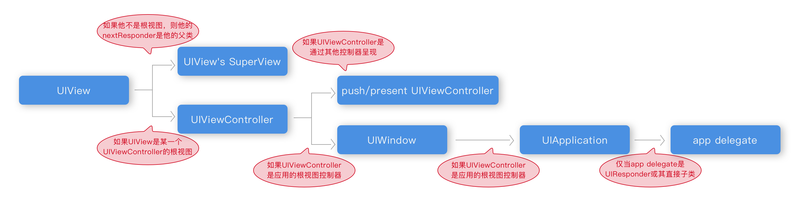

> 事件响应者链的作用
>
> 事件的传递顺序
>
> 事件的响应顺序

----

### UIResponder

在iOS中，能够响应事件的对象都是`UIResponder`的对象，包括UIApplication、UIViewController、UIView以及他们的子类。UIResponder是组成事件响应链的基本单位，也是其中的一个节点，其中每一个节点都可以作为上个节点的nextPesponder。当响应者收到一个（触摸）事件，会根据他自身的设置来决定是由他来处理还是交给nextPesponder来处理，并且系统有一个默认的规则用来决定交给谁来处理，这就是响应链。

一个触摸事件发生之后，系统会将事件加到UIApplication来进行事件传递，事件传递的目的就是要查找到最后处理事件的视图，这个顺序恰恰是和视图的层次结构相反的。


### touchesXXX

UIResponder类有一系列的方法，用来捕获触摸的开始、移动、结束、取消事件的回调，这些方法中都接收两个参数：UITouch对象的集合（点击对象），UIEvent对象（事件对象）。其中UITouch表示的是一次触摸的抽象对象，UIEvent代表的是当前触摸的是什么事件：多点触摸、移动拖拽、远程操作、3D Touch。

```objective-c
- (void)touchesBegan:(NSSet<UITouch *> *)touches withEvent:(nullable UIEvent *)event;
- (void)touchesMoved:(NSSet<UITouch *> *)touches withEvent:(nullable UIEvent *)event;
- (void)touchesEnded:(NSSet<UITouch *> *)touches withEvent:(nullable UIEvent *)event;
- (void)touchesCancelled:(NSSet<UITouch *> *)touches withEvent:(nullable UIEvent *)event;
```

当触摸产生之后，会根据UIApplication、UIWindow、UIViewController、UIView、subView的顺序进行事件分发，来查找最终要对本次触摸进行处理的视图，查找处理的视图的方法主要通过两个方法来决定：

```objective-c
- (UIView *)hitTest:(CGPoint)point withEvent:(UIEvent *)event
- (BOOL)pointInside:(CGPoint)point withEvent:(UIEvent *)event;
```


### hitTest

只要UIEvent传递给一个控件，他就会通过`hitTest:withEvent:`方法来寻找合适的view（一般都是自己的子视图）来处理这个UIEvent。

事件传递过程中会调用传递到的这个view的`hitTest:withEvent:`方法，如果返回nil，那么该方法的控件本身和子控件不是最合适的view，那么最合适的view就应该是该控件的父控件。

可以通过重写该方法来将控件的处理点击事件的区域进行改变，或者直接返回子视图，让子视图作为处理事件的视图。


### nextResponder

默认情况下，系统有一个默认响应者链，这个响应者链的关键就是各个节点（UIResponder）、以及节点所需要指向的下一个节点（nextResponder）:



开发者可以通过修改这种默认规则来完成修改响应者链，比如，重写UIView的`hitTest:withEvent:`事件或者`pointInside:withEvent`事件。

### example-01


### example-02


----

https://developer.apple.com/documentation/uikit/touches_presses_and_gestures/understanding_event_handling_responders_and_the_responder_chain?language=objc

https://blog.csdn.net/chun799/article/details/8223612

http://www.cocoachina.com/ios/20160113/14896.html

https://blog.csdn.net/langzi7758521/article/details/52403483

https://www.jianshu.com/p/2e074db792ba