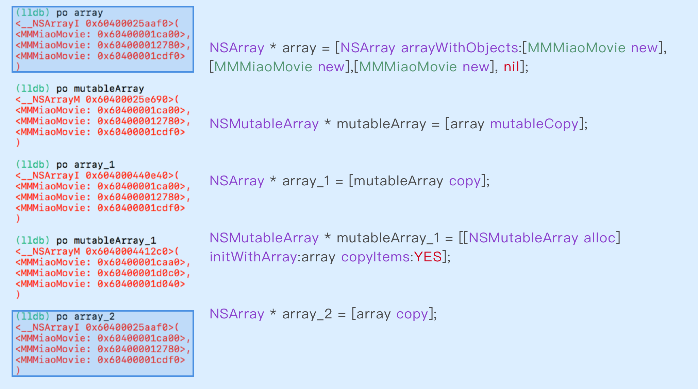

>什么是NSCopying协议
>
>深拷贝和浅拷贝的区别

-----

### \<NSCopying\>协议

// 协议中的主要方法是什么，一个自定义类要具备copy的能力，需要怎么做

在Foundation中，有两个与copy相关的协议：

```objective-c
@protocol NSCopying
- (id)copyWithZone:(nullable NSZone *)zone;
@end

@protocol NSMutableCopying
- (id)mutableCopyWithZone:(nullable NSZone *)zone;
@end
```

这两个协议中的参数NSZone可以不用理会，因为在以前会据此把内存分成不同的区，而对象就在这些区中被创建，现在每个程序都使用一个默认区。


### copyWithZone:

// 重写这个方法都需要在里面做什么

// 这个方法的作用是什么

如果一个类需要支持copy，除了准守NSCopying协议以外，就是要重写copyWithZone:方法了（NSMutableCopying类似），

```objective-c
- (id)copyWithZone:(NSZone *)zone
{
    MMRunwayLabel *label = [[[self class] allocWithZone:zone] init]; // <== 注意这里
    if (self.text) {
        [label configText:self.text];
    }
    if (self.attributedText) {
        [label configAttributedString:self.attributedText];
    }
    label.frame = self.frame;
    return label;
}
```


### deep & shallow

深拷贝的意思是在拷贝对象本身的时候，将其底层数据也一并复制一份，而浅拷贝则不同，它是仅仅拷贝对象本身。比如Foundation中的所有容器类都是执行的浅拷贝，因为容器内部的对象不一定是可以拷贝的（准守NSCopying协议），所以**所有的容器类都是默认执行的浅拷贝**。

对于需要执行深拷贝的对象，具体实现方法要根据具体的业务来决定，比如可以结合NSArray的文档中有一个API可以用来实现自定义类中的深拷贝操作（类似的NSSet中也有）：

```objective-c
- (instancetype)initWithArray:(NSArray<ObjectType> *)array copyItems:(BOOL)flag;
```

需要注意的一点是，数组内部的元素一定要确保遵守了NSCopying协议，并且实现了copyWithZone:方法，不然会引起crash。


### mutableCopy & copy

对于具有可变子类的类来说，可以使用mutableCopy和copy将类在可变与不可变之间进行转换。



通过上面的一个例子可以总结如下：

* mutableCopy默认执行浅拷贝，可以将不可变对象变成可变对象
* copy会将可变对象变成不可变对象，默认也是执行浅拷贝
* copy一个不可变对象不会引起新内存的分配，两个指针都指向已有内存
* 如果要执行深拷贝，需要在特定的api中显示的声明


### 无协议Copy

// AHKBuilder 中的 copyWithBuilder_ahk: 方法实现原理

当需要对一个对象执行copy操作，目的仅仅是获取该对象中已有的数据存储，一般来说就是该对象的属性值。除了要遵守NSCopying协议之外，还可以使用runtime在不遵守协议的情况下完成''copy''操作。

 // todo 


---

https://github.com/fastred/AHKBuilder

//《 Effective objective-c 2.0 》 第22条

https://developer.apple.com/documentation/foundation/nscopying?language=objc

