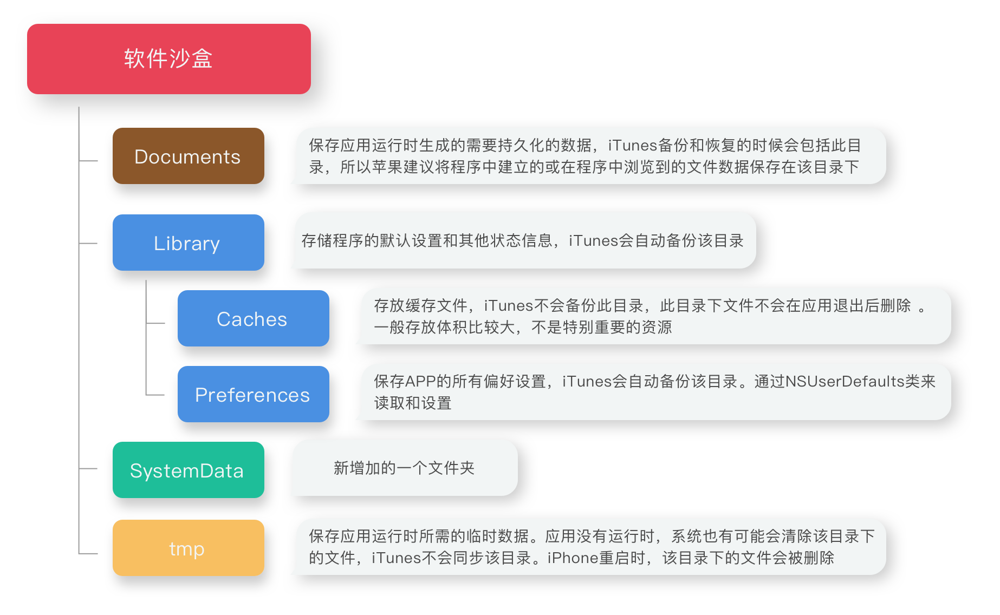

> iOS的沙盒机制是什么
>
> 系统默认提供几种文件夹，他们的作用都是什么
>
> NSFileManager是线程安全的类么
>
> 有用过哪些优秀的第三方缓存库

---

### 沙盒机制

每一个iOS应用程序都会为自己创建一个文件系统目录（文件夹），这个独立、封闭、安全的空间叫做**沙盒**。沙盒就是一种安全体系，它规定了应用程序只能在为该应用程序创建的文件夹（沙盒）内访问文件，不可以访问其他沙盒内的内容（iOS8已经部分开放访问），应用程序向外请求或接收数据都需要经过权限认证。所有的非代码文件都保存在这个地方，比如图片、声音、属性列表（plist）、sqlite数据库和文本文件等。


### 文件夹

在每一个应用的沙盒下，系统都默认的提供了几个文件夹，供开发者存储数据使用：



对应获取路径的代码如下：

```objective-c
// 获取Document目录 - NSDocumentDirectory
NSString *docPath = [NSSearchPathForDirectoriesInDomains(NSDocumentDirectory, NSUserDomainMask, YES) lastObject];
 
// 获取Library目录 - NSLibraryDirectory
NSString *LibraryPath = [NSSearchPathForDirectoriesInDomains(NSLibraryDirectory, NSUserDomainMask, YES) lastObject];
 
// 获取Caches目录 - NSCachesDirectory
NSString *cachesPath = [NSSearchPathForDirectoriesInDomains(NSCachesDirectory, NSUserDomainMask, YES) lastObject];
 
// 获取Preferences目录 通常情况下，Preferences有系统维护，所以我们很少去操作它。
NSString *preferPath = [LibraryPath stringByAppendingPathComponent:@"Preferences"];

// 获取tmp目录 - NSTemporaryDirectory()
NSString *tmpPath = NSTemporaryDirectory();
```


### thread-safe

NSFileManager的单例对象**不被认为是线程安全的**，如果要在多个线程中安全调用，比如使用一个委托接收通知的状态移动、复制、删除和链接操作，那么应该创建一个独特的文件管理器对象的实例（使用alloc-init而不是defaultManger），然后来分配你的委托对象，并使用这个fileManager对象在非主线程中进行文件操作。


### Archiver

一般来说，系统对于一些基本数据类型提供了读写(I\O)操作，比如NSData、NSString、NSArray、NSDictionary这些类：

```objective-c
// NSData
NSData * data;
[data writeToFile:@"file-path" atomically:YES];

// NSString
[@"" writeToFile:@"file-path" atomically:YES encoding:NSUTF8StringEncoding error:nil];
```

但是对于复杂对象，比如一个自定义的实例对象类需要保存到本地，可以使用归档\解档的组合方式来进行存取。需要进行本地存储的类需要遵守`NSCoding`协议，并且重写协议里的两个方法之后，就可以使用NSKeyedUnarchiver来进行对象的解归档，然后根据需要使用writeToFile、NSUserDefault存入本地：

```objective-c
// 归档
- (void)encodeWithCoder:(NSCoder *)aCoder{
  [aCoder encodeObject:_someProperty forKey:@"someProperty"];
  // ...
}

// 解档
- (instancetype)initWithCoder:(NSCoder *)coder{
    if (self  = [super init]) {
        _someProperty = [aDecoder decodeObjectForKey:@"someProperty"];
        // ...
    }
    return self;
}
```


### cache

缓存分为磁盘缓存和内存缓存，内存缓存提供容量小但高速的存取功能，磁盘缓存提供大容量但低速的持久化存储。第三方缓存库中都是以两者结合的模式提供API。

简单的内存缓存比如系统的NSCache、NSDictionary都可以完成任务；而磁盘缓存基本上都是基于文件系统的，比如采用数据库、plist、mmap文件内存映射。

目前主流的缓存库有TMCache、PINCache、YYCache，性能依次增强，具体之间的区别可以参考[这里的描述](https://blog.ibireme.com/2015/10/26/yycache/)。


----

https://developer.apple.com/documentation/foundation/nsfilemanager

http://www.cocoabuilder.com/archive/cocoa/286578-nsfilemanager-alloc-init-considered-thread-safe.html

https://blog.ibireme.com/2015/10/26/yycache/