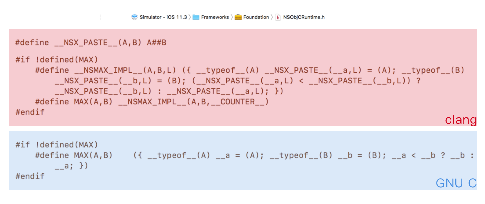
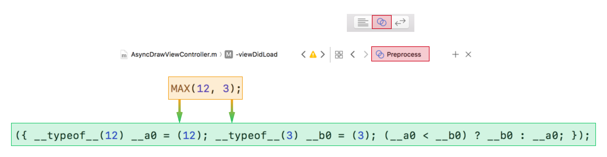

> 宏的本质是什么
>
> RAC中的宏的实现原理
>
> inline 函数和宏之间的区别

---

### 宏

宏是编译器的预处理，会在预编译阶段将其展开。宏通过一个`define`关键字来进行定义，主要用在一些常用的文本替换（对象宏）、方法实现（函数宏）。这是NSObjectRuntime中关于MAX宏的定义，有两个版本：clang和GUN C。



使用Xcode提供的Assistant可以查看预处理和预编译阶段的代码，通过Assistant查看宏展开之后的样子：




### \、##、\__COUNTER__

宏定义以换行符结尾，这意味着一个宏定义不论多长都只能写在一行中，如果需要分行写，就需要使用 `\`来表示换行。

宏允许有参数，比如上面的MAX宏就支持两个参数：A、B。有的时候需要将参数进行组合，比如使用宏简化单例的实现模式的时候，就需要将类名和组合起来，这时候需要使用`##`，

其实 \__COUNTER__ 是一个预定义的宏，这个值在编译过程中将从0开始计数，每次被调用时加1。因为唯一性，所以很多时候被用来构造独立的变量名称。上面的MAX宏在clang和GUN C的实现的区别之处就是这个宏，在为变量名A和B添加了一个计数后缀，**这样大大避免了变量名相同而导致问题的可能性**。

另外，由于宏是编辑器的预处理，难保会出现一些运算优先级别的问题，所以上面的A和B在使用的时候都使用了**圆括号进行包裹**，以达到不与宏外面的运算混淆的目的。

除了上面提到的一些关键字或者写法注意事项，还有一点，宏里面比较常用的一个点是**内联符号表达式**，也就是上面的`({…})`写法，这是GUN C中的赋值拓展，会将大括号结尾处的值付给变量：

```c
int a = ({
    int b = 12;
  	int c = 2;
  	b + c;
})
  
a;
// a = 12 这里的b和c都是局部变量，不会污染赋值a的时候的作用域，还可以将代码逻辑归于一处
```


### \_\_typeof()、 \_\_typeof\_\_()、typeof()

前两个是标准C对于特定编译器的拓展，可以理解为不同版本C语言中的运算符号：标准C要求编译器使用`__`添加，所以标准C语言中的拓展基本上都是以`__`开头的，而GUN C（支持标准C的基础上做了一些拓展）则没有这一个要求（可以理解为最后一个等价于前面两个写法）。

目前Xcode使用的C语言版本是GUN C，因此常见的写法是typeof()，在防止block中产生循环引用经常这样使用：

```objective-c
typeof(self) weakSelf = self;// 常用写法
__typeof(self) __weakSelf = self;// 等同⬆️
__typeof__(self) __weakSelf__ = self;// 等同⬆️
```


### do-while

系统提供的一些函数宏是可以满足日常开发，但是在debug的时候进行自定义的log输出则是每位开发者都偏向于去做的事情，自定义的宏可以在debug时提供更多的信息，并且在release下一句也不进行打印：

```objective-c
#define NSLog(format, ...) do {\
                             fprintf(stderr, "<%s : %d> %s\n",\
                             [[[NSString stringWithUTF8String:__FILE__] lastPathComponent] UTF8String],\
                             __LINE__, __func__);\
                             (NSLog)((format), ##__VA_ARGS__);\
                             fprintf(stderr, "-------\n");\
                           } while (0)
```

这个提供和系统NSLog同名的函数宏中的一些点都是常用的，比如`__FILE__`、`__func__`、`…`、`__VA_ARGS__`这些，但是这里一个比较重要的点是一个`do-while`。

在这里使用do-while主要是为了**吞分号**，难保会有使用者在宏后面加分号，一般情况下按照正常的写法使用宏都是没有问题的，但是也会有各种意想不到的使用方法，具体的错误写法可以参考[喵神的文章中关于log章节](https://onevcat.com/2014/01/black-magic-in-macro/)和[这篇专栏中的吞分号章节](https://zhuanlan.zhihu.com/p/27150985)。


### static const


### inline

内联函数是在编译时将函数体嵌入在每一个调用处，这一点和宏很类似。

在C语言中，如果一些函数被频繁调用，不断地有函数入栈会造成栈空间或**栈内存**的大量消耗。栈空间就是指放置程式的局部数据也就是函数内数据的内存空间，在系统下，栈空间是有限的，假如频繁大量的使用就会造成因栈空间不足所造成的程式出错的问题。因此开发中会使用**全局静态内联函数**将这些常用函数进行替换。

要使一个函数成为具备内联的特点，需要**在函数的实现处使用关键字inline来修饰**。

简单函数宏可以使用内联函数进行替换，因为内联函数写起来更加的直观，不像宏一样没有特别的颜色和提示。

使用内联函数有一些注意事项：

* 不要过分的使用内联函数，而应该只将一些简单逻辑放入函数内部
* 内联函数内部不要出现循环(while、switch之类的循环操作)
* 内联函数不应该进行递归调用


### ReactiveCocoa

在RAC中有大量的函数宏（func-like marco）。在使用大量的有系统关系的宏的时候，就需要为这写宏设计出来一个规范，以一种编程的思想来编写宏，这个在RAC中有大量的运用，主要的宏定义[参考这篇对RAC中宏解读的文章](https://www.jianshu.com/p/4c5613e256c8)。


---

[ReactiveCocoa 中 奇妙无比的“宏”魔法](https://www.jianshu.com/p/4c5613e256c8)

[宏定义黑魔法-从入门到奇技淫巧(6)-宏常见的坑](https://zhuanlan.zhihu.com/p/27150985)

[宏定义的黑魔法](https://onevcat.com/2014/01/black-magic-in-macro/)

[stackoverfolw:typeof()之间的不同](https://stackoverflow.com/questions/14877415/difference-between-typeof-typeof-and-typeof-objective-c)