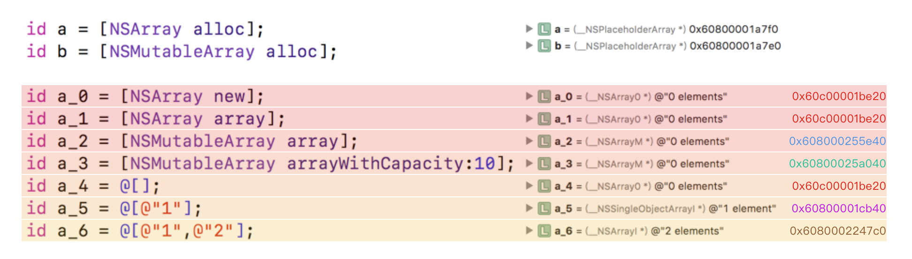
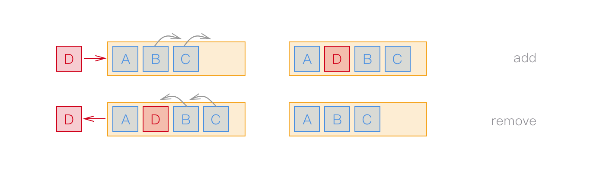

> NSArray在类簇模式下的实现
>
> 如何高效的对一个可变数组进行增删操作

---

### Class Clusters

类簇是抽象工厂模式在iOS下的一种实现，NSArray就是这种模式下的实现类。在创建NSArray实例的时候，Foundation内部隐藏了实现细节，通过下面的初始化方法可以看出来，`+alloc`并没有生成期望的类（这里是`__NSPlaceholdrArray*`），而且针对不同的初始化方法生成的对象的isa也不同（分别是`__NSArray0*`、`__NSArrayI*`、`__NSArrayM*`、`__NSSingleObjectiveArrayI*`）。

[孙源的从NSArray看类簇](http://www.cocoachina.com/ios/20141219/10696.html)文章中指出（猜测），`+alloc`之后是生成的中间类（`__NSPlaceholdrArray*`）使用静态实例地址方式在`-init`之后生成对应的类（`__NSArrayI*`、`__NSArrayM*`）。但是从上图可以看出来，当一个不可变数组为空的时候生成的是`__NSArray0*`，并且a\_0、a\_1、a\_4都是空的不可变数组，他们的内存地址都是一样的，可以猜测他们都是使用的同一个静态实例对象，因为他们之间没有不同，都是空的不可变数组（这一点在NSString中也是一样的，相同的字符串内容的指针指向的内存地址也是一样的）。

### NSMutableArray

在想象中的数组是

### Circular buffer

除非缓冲区已满，否则从任一端插入、删除都不需要移动任何内存。

让我们来分析一下这个类是如何利用循环缓冲区比C数组更好的行为。

### \_\_NSArrayM

----

[从NSArray看类簇](http://www.cocoachina.com/ios/20141219/10696.html)

[实现 CFArray](https://blog.ibireme.com/2014/02/17/cfarray/)

[NSArray 丢失的 firstObject 方法](https://blog.ibireme.com/2013/08/07/nsarray-firstobject/)

[Exposing NSMutableArray](http://ciechanowski.me/blog/2014/03/05/exposing-nsmutablearray/)

[class-dump出来Cocoa的头文件：_NSArrayM](https://github.com/nst/iOS-Runtime-Headers/blob/master/Frameworks/CoreFoundation.framework/__NSArrayM.h)

http://gracelancy.com/blog/2014/04/21/toll-free-bridging/

