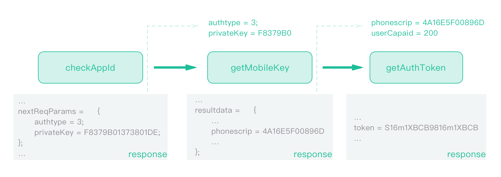

> 通过一键登录的SDK获取本机手机号码
>
> 解剖一个获取本机手机号码SDK

---

### func

在Apple上架的app很难能获取到本机的手机号码（完整号码），但是目前很多的用户流程中会刻意的较少用户输入操作，比如，使用本机号码一键登录，不需要输入手机号以及密码。目前有这样的SDK可以做到，比如[中国移动提供的方案](http://dev.10086.cn/cmpassport/quickLogin.html)，像这种运营商提供的方案还是比较稳妥的。

在接入了他们的sdk之后觉得，不是很友好，具体表现在一键登录的界面不可以完全自定义，以及显示获取token之前有必要先进行预取号，如果不进行预取号会出现一个加载中的界面，逻辑上没什么问题，使用起来会觉得很不顺手。另外很好奇他们是如何获取到本机手机号码的，因此使用hopper和monkeyDev进行了一番研究，毕竟UI什么的都可以将就，探究出来他们的内部实现逻辑才是主要目的。
​         

### 逻辑
根据文档可以知道，所有的操作都是为了获取一个`token`，可以通过隐式和显式两种方式来获取。这里使用的是显示获取token的方式，在获得到token之后调用一个接口，传递对应的参数就可以获得到完整的本机号码（在获取token的时候获取的是不完整的手机号码）。内部所有的网络请求主要是通过`UANetwork`内部调用NSURLSession发起的，通过研究整理出来主要的步骤为：
``` objective-c
    [UANetwork setTraceId:[UAUtil uuid]];
    [UANetwork setInvokingFlag:YES];
    [UANetwork checkAppIdWithParams:nil completion:^(id data1){

       [UANetwork getMobileKeyWithParams:data1[@"nextReqParams"] completion:^(id data2){

           NSDictionary * params = @{@"scrip":data2[@"resultdata"][@"phonescrip"],
                                   @"userCapaid":@"200"
                                   };
           [UANetwork getAuthTokenWithParams:params completion:^(id data3){

               self.token = data3[@"token"];
               [self loginTokenValidate];
           }];
       }];
    }];
```
由于这个UANetwork是SDK内部的类，外面不可以直接使用，使用runtime或者performSelector可以解决这个问题：
``` Objective-C
    id UAUtil = [NSClassFromString(@"UAUtil") uuid];
    
    Class UANetworkClass = NSClassFromString(@"UANetwork");
    [UANetworkClass performSelector:NSSelectorFromString(@"setTraceId:") withObject:UAUtil];
    [UANetworkClass performSelector:NSSelectorFromString(@"setInvokingFlag:") withObject:@(YES)];
    void (^block)(id data) = ^(NSDictionary * data){
        NSLog(@"1️⃣直接调用UANetwork-checkAppIdWithParams的返回结果:%@",data);
        NSDictionary * nextReqParams = [data.allKeys containsObject:@"nextReqParams"] ? data[@"nextReqParams"] : nil;
        if (nextReqParams) {
            void (^block2)(id data) = ^(NSDictionary * data2){
                NSLog(@"2️⃣直接调用UANetwork-getMobileKeyWithParams的返回结果：%@",data2);
                NSString * phonescrip = [data2.allKeys containsObject:@"resultdata"] ? data2[@"resultdata"][@"phonescrip"] : nil;
                if (phonescrip) {
                    void (^block3)(id data) = ^(NSDictionary * data3){
                        NSLog(@"3️⃣直接调用UANetwork-getAuthTokenWithParams的返回结果：%@",data3);
                        self.token = data3[@"token"];
                        [self loginTokenValidate];
                    };
                    NSDictionary * params = @{@"scrip":phonescrip,
                                              @"userCapaid":@"200"
                                              };
                    [UANetworkClass performSelector:NSSelectorFromString(@"getAuthTokenWithParams:completion:") withObject:params withObject:block3];
                }
            };
            [UANetworkClass performSelector:NSSelectorFromString(@"getMobileKeyWithParams:completion:") withObject:nextReqParams withObject:block2];
        }
    };
    [UANetworkClass performSelector:NSSelectorFromString(@"checkAppIdWithParams:completion:") withObject:nil withObject:block];
```


### flow

拆分开上面的流程为三步来分析。



第一步是UANetwork中的 `+checkAppIdWithParams:completion:` 方法，params为nil，这一步主要是为了检查AppId（但是源码传递了nil，不知道是要怎么检查），以及获取下一步的 `privateKey`，他的response为：

``` Objective-C
  {
    capaids = "4,7";
    nextReqParams =     {
        authtype = 3;
        privateKey = F8379B01373801DE;
    };
    privateKey = F8379B01373801DE;
    resultCode = 103000;
  }
```

第二步是UANetwork中的 `+getMobileKeyWithParams:completion:` 方法，params为上第一步response中的`nextReqParams`，这一步主要是为了获取手机号以及关键的下一步的参数`phonescrip`，他的response为：
```Objective-C
  {
     resultCode = 103000;
     resultdata =     {
         openId = UF216m1XBCB984AE7A95D0E073BFCtzC6XbdVCssE6Bb8Jwc;
         phonescrip = 4A16E5F00896DF036m1XBCB984AE7A95D0E073BFCtm1XBCB984AE7A95D0E073BFCtzCB984AE7A95D0E073BFCtzCEE904594DC71DE3B9869AE832B45FB6m1XBCB984AE7A95D0E073BFCtzCDC798689A5E5Em1XBCB984AE7A95D0E073BFCtzC103EF8B08700ABA3ACBm1XBCB984AE7A95D0E073BFCtzC05F1533D39E6B;
         securityphone = "102****7124";
     };
  }
```

第三步是UANetwork中的 `+getAuthTokenWithParams:completion:` 方法，params为上面response中的`resultdata.phonescrip`和`userCapaid（写死为200）`，这一步主要是`获取token`，然后使用token调用 `https://www.cmpassport.com/unisdk/rsapi/loginTokenValidate` 接口获取完整的手机号码，他的response为：
``` Objective-C
  {
     authType = 1;
     authTypeDes = "WIFI\U7f51\U5173\U9274\U6743";
     openId = UF216m1XBCB984AE7A95D0E073BFCtzC6XbdVCssE6Bb8Jwc;
     resultCode = 103000;
     token = S16m1XBCB9816m1XBCB984AE7A95D0E073BFCtzC6XbdFCtzC6Xbd5;
  }
```


### UANetwork

上面将sdk内部的网络请求理清楚之后得出三个主要的方法:
+ **+ (void)checkAppIdWithParams:(id)arg1 completion:(id)arg2;**

+ **+ (void)getMobileKeyWithParams:(id)arg1 completion:(id)arg2;**

+ **+ (void)getAuthTokenWithParams:(id)arg1 completion:(id)arg2;**


通过hopper查看可以发现第一步和第三步的接口内部都是调用的UANetwork的`requestNetworkWithURL:params:method:completion:`方法，而第二步的`getMobileKey`接口内部调用的是`socketWithHost:port:params:prefix:method:completion:` 方法。使用monkeyDev对这些方法进行hook可以发现对应的url、params以及调用方法如下：

  1.https://www.cmpassport.com/unisdk/rs/ckRequest
``` json
requestNetworkWithURL:<https://www.cmpassport.com/unisdk/rs/ckRequest>
params:<{
       appid = 201e1dbe0a503f28EA76;
       interfacever = "2.0";
       keyid = 0D689694882F0843a1c523b2710b46278f20;
       msgid = 710b46278f201e1dbe0a503f28EA76C9Fa1;
       sdkver = "quick_login_ios_5.3.2-20180126";
       sign = 0a503f3fe0a503f500D689694882F0843a1;
       timestamp = 20180519171045673;
       ver = "1.0";}>
method:<POST>
```

2.socket
``` json 
requestSocketWithBodyString:<{"interfacever":"3.0",
                              "keyid":"0D689694882F0843a1c523b2710b46278f20",
                              "reqdata":"wrF+2TlzCybfb1NEz0oAUFB10D689",
                              "ver":"1.0"}>
method:<post>
host:<www.cmpassport.com>
port:<80>
```

3.https://www.cmpassport.com/unisdk/api/getAuthToken
``` json
requestNetworkWithURL:<https://www.cmpassport.com/unisdk/api/getAuthToken>
params:<{
       appid = 201e1dbe0a503f28EA76;
       interfacever = "2.0";
       msgid = 710b46278f201e1dbe0a503f28EA76C9Fa1;
       scrip = 84BCa1c523b2710b46278f201e1dbe0a503f3fe0a503f500D689694882F0843a1c523b2710b46278f201e1dbe0a503f274BCBA4a1c523b2710b46278f201e1dbe0a503f173F2a1c523b2710b46278f201e1dbe0a503f28EA76C9Fa1c523b2710b46278f201e1a1c523b2710b46278f201e1dbe0a503fB34004D2C21CDE;
       sign = 0a503f3fe0a503f500D689694882F0843a1;
       userCapaid = 200;
       version = "0.1";}>
method:<POST>
```

另外在每一步的请求中，都会进行一个log请求的调用，url为：https://wap.cmpassport.com:8443/log/logReport，参数及其多，具体可以参考demo中给出的示例。

到这里整个SDK的核心逻辑就算理出来了，主要是通过一些接口，一步步的来获取本机手机号码，其中的那个socket就没有研究内部的实现原理。基本上除了socket这一个网络请求，其他的都可以使用自己的网络请求框架进行处理逻辑，但是针对于一个第三方SDK来说，最好还是不要去做重复的事情，仅限于知道他们的内部实现原理就好了，不要去自己再实现一遍！SDK更新频繁不说，万一一些逻辑自己没有想到但是SDK内部有处理的话就会照成一些损失。