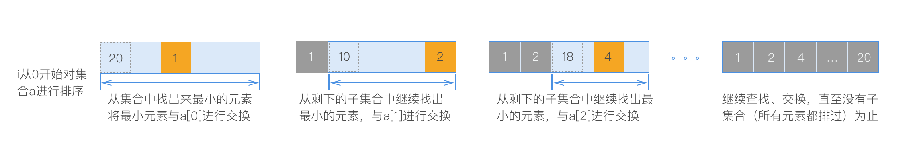
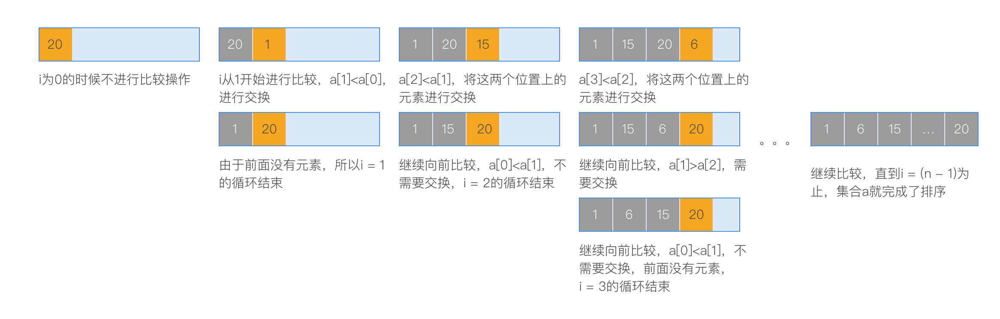
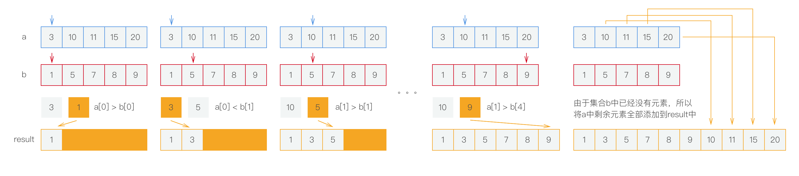

> 理解几种简单的排序算法
>
> 这几种排序算法的核心
>
> 各自的优劣以及他们之间的不同

----

### 排序

一个有序的集合在处理选择（查找）问题的时候会提供很大的便利，这种便利不仅体现在查找速率上，还能大大的提高对内存的使用率。通常来说，排序是其他算法中的一个步骤，在常用的一些查找算法中，比如二分法查找，排序是它的一个预处理步骤。这里列出来简单的排序算法，他们各有优缺点，是以后接触其他排序算法的基础算法。

将一个无序集合进行排序的常用需求为：将集合中的元素根据某个规则按照升序、降序排列。对实际情况进行抽象之后使用数学模型可以简化为：对一个包含数字的集合进行从小到大、从大到小的顺序排列。

一个排序算法的好坏主要体现在它的**比较操作**和**移动操作**所进行的次数，先给出结论：以下四种排序算法在时间复杂度上来说，选择排序和插入排序都是效果很差的算法，而归并排序和快速排序都是比较好的算法。

这里假设需要对一个无序集合a进行排序，以下是四种排序算法的不同实现方式。

### 选择排序

选择排序就是对集合进行遍历，每一步遍历都从该索引后面的子集合找出来最小（最大）的值，将该值放到该索引处，直到遍历完所有元素：

按照每一轮比较都是最坏的情况，每次循环中需要进行**查找(比较)操作**和**交换(移动)操作**。每次查找需要迭代(n - i)次，整体需要的查找时间为一个等差数列的和：n + (n-1) + (n-2) +…+ 1，也就是(n^2^/2+n/2)；交换操作是线性的，每次为1，总共也就n次。两者相加所需的时间为(n^2^/2 + 3\*n/2)，忽略低阶项（3\*n/2）和常量因子（1/2），最后可以估算需要的循环次数为O(n^2^)，也就是运行时间为O(n^2^)。

选择排序比较消耗时间的操作在于每次在子集合中找出来最小元素。

### 插入排序

插入排序比较耗时的地方是每次向前比较的操作，当一个大到小排列的集合进行重新按照从小打大排序的时候，就是最糟糕的情况，每一次都需要向前比较所有的元素。但是插入排序比较实用的一个场景是**集合中已经有了基础排序**，也就是有一部分元素是有序的，那么每次不论比较操作还是移动操作都会比较快，这时候使用排序算法是最佳的选择。

### 归并排序
在接触归并排序之前，先来了解一下归并(合并)操作，假如有两个有序集合，里面的元素按照从小到大进行排列，现在要将这两个集合合并成一个集合，合并之后的集合还是按照从小到大的顺序排列。具体做法是，依次比较两个集合中的元素，将比较的元素中比较小的（这里假如是按照升序排列）挑出来放入一个新的集合中，然后从该集合的下一个元素和另外一个集合的元素依次比较，直到其中一个集合中没有可比较的元素为止，则将另一个集合中剩余的元素依次放入新的集合中。

一个`归并操作`的比较排序过程如上所示，**归并操作是归并排序的核心思想**。

通常来说，归并排序是使用的一种称为`分治法`的通用模式。

在归并排序中，是将已有的集合进行划分成小集合，小集合再划分，直到每一个集合中只有一个元素为止，当一个集合中只有一个元素的时候，就可以认为它是有序的，这前面的步骤是**分解**；接下来的步骤就是需要将分解出来的所有小集合进行归并操作，按照需求进行排列合并，每两个小集合会合并成一个集合，然后合并成的集合再进行归并操作，直到没有小集合为止，这一步骤就是**合并**。

### 快速排序

