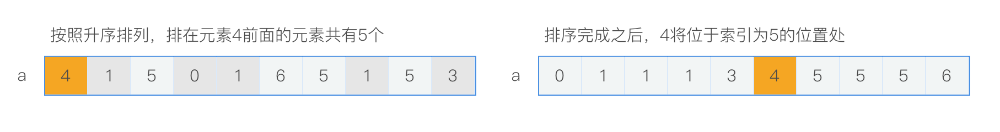
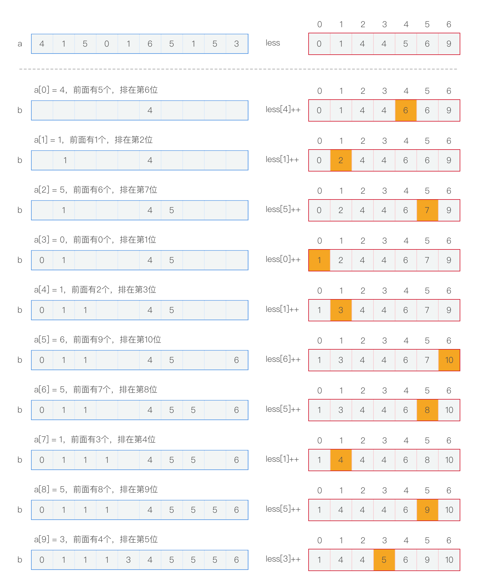

> 如何优化比较排序
>
> 比较排序的特点：牺牲空间换时间
>
---

### 更快的排序

前面的几种排序算法都有一个特点：它们都是基于比较两个元素来进行排序。这对于n比较大的情况下，运行时间就会很长，虽然可以通过不同的方式，比如归并排序、快速排序来提高排序效率，但是极限也就仅仅是O(nlgn)。

不使用比较的排序算法有计数排序和基数排序（也叫桶排序），其中计数排序是基数排序的核心思想，如同归并操作是排序的核心思想一样。这两种排序算法都是牺牲空间换时间的算法，并且他们都是具备**稳定性**的算法，所谓稳定性就是指，具备相同的排序关键字的元素在最终排序完成的数组中的次序和原数组中的次序是一样。

### 计数排序

计数排序是基于一个常识来进行实现的：如果元素k在数组中有x个，并且最终排序之后排在他前面的元素有y个，那么在最终完成排序的数组中，k元素的索引为[y，y + x - 1]的范围内。如下图：

那么也就是说，如果知道了元素的个数以及排在该元素之前的总元素个数，就可以知道该元素在最终排序完成数组中的位置范围。但是要记录该元素之前有多少元素，需要知道的一点是，原数组中元素的取值范围，这样才好将原数组中的每一个元素进行计数操作。

假如数组中所有元素的取值范围为小于m的整数（这个例子中，m = 7），那么就创建一个等m长度的数组，记为less，用来存储每一个索引代表的元素之前有多少个元素。具体算出来less的方法有很多，这都不是很难，**结果是要得出来一个用来表示该元素之前有多少个元素的数组less**。有了数组less之后，就可以使用计数排序对数组进行排序。

得到less之后，可以通过遍历原数组（记为a数组），通过找到每一个索引下的元素，将该元素作为less的索引来获取该元素之前有多少个元素，那么最后的数组（与a数组等长度的数组，记为b数组）中，该元素就可以排在对应个数的索引处，另外还需要将less中该元素下的值进行自增。具体的流程如下所示：

### 基数排序

### 希尔排序

### 

