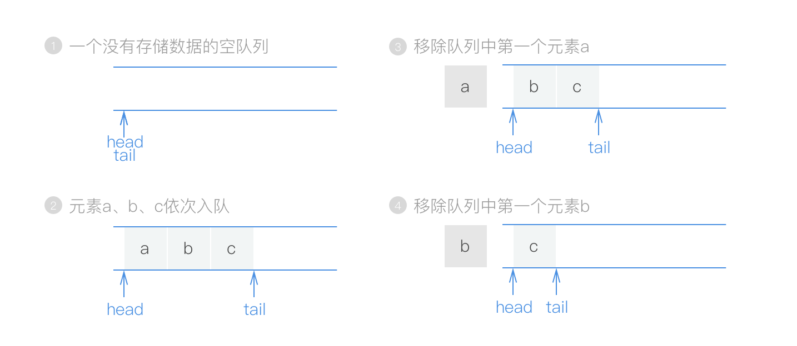
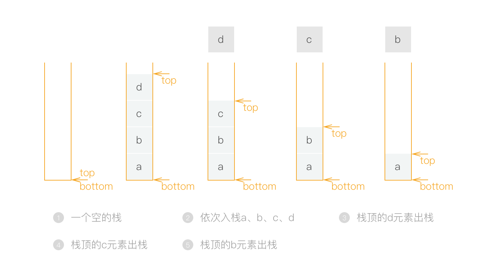
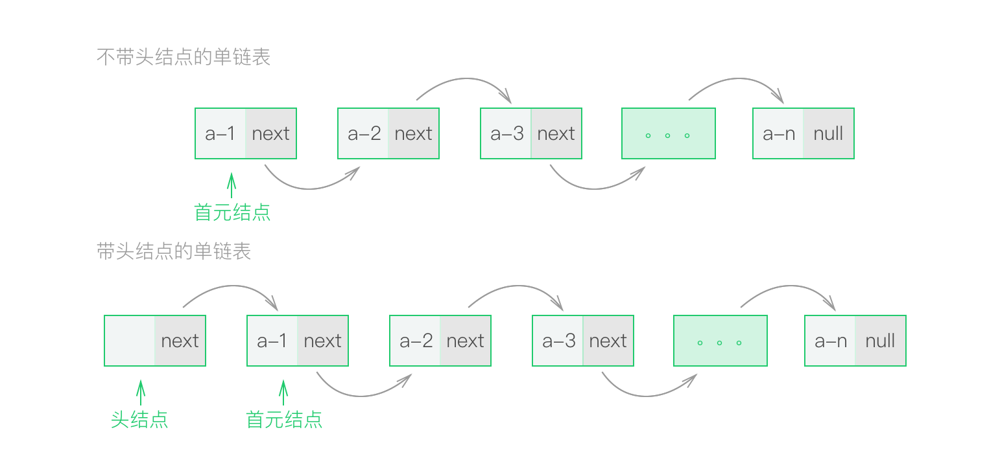
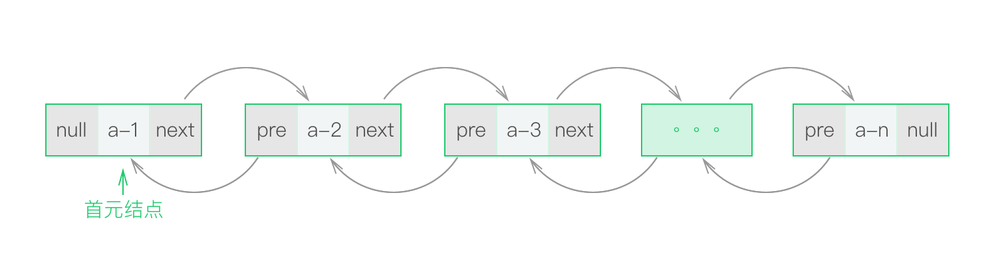
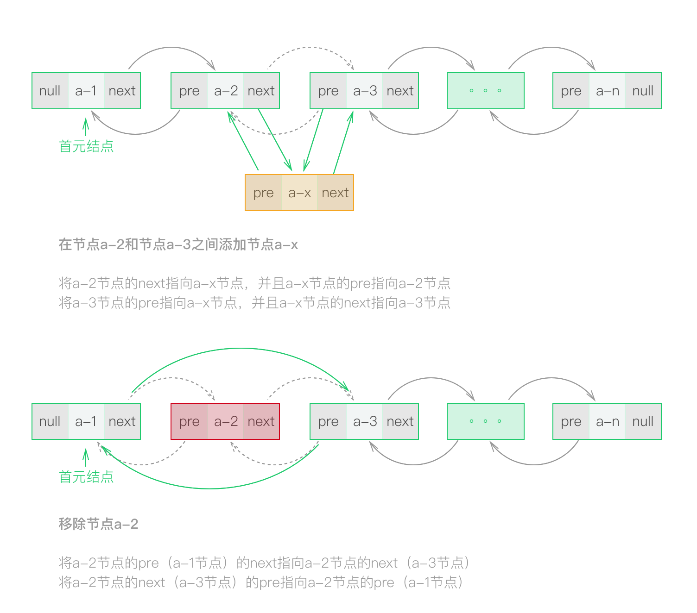

> 了解几种基础的数据结构
>
> 了解这些数据结构的特点以及使用场景
>
> 这些基础数据结构涉及到的[一些面试题目](https://github.com/CyC2018/Interview-Notebook/blob/master/notes/剑指%20offer%20题解.md)
---

### 队列

队列是一种线性存储的数据结构，它对于新元素的插入操作必须在尾部进行，并且移除元素的操作要在头部进行，这样的要求就确保了存储的元素可以按照先进先出的顺序进行新增和移除，也就是说队列是`FLFO`结构的。

一般向队列中添加元素成为入队，从队列中删除元素成为出队。可以看出来，队列元素的出列是在队头，即下标为0的位置。为保证队头不为空，每次出队后队列中的**所有元素都需要向前移动**，此时时间复杂度为 `O(n)`。而入列则是直接在队列尾部进行添加元素，时间复杂度为`O(1)`。

一种改良优化之后的队列可以将出列的时间复杂度进行减少，

> * [9-用两个栈实现队列](https://github.com/CyC2018/Interview-Notebook/blob/master/notes/剑指%20offer%20题解.md#9-用两个栈实现队列)

### 栈

栈是仅允许在表尾进行插入和删除操作的线性表。通常把允许插入和删除的一端称为栈顶（top），另一端称为栈底（bottom），它是一种后进先出（Last In First Out）的线性表，简称`LIFO`结构。栈的一个典型应用是在集合中保存元素的同时**颠倒元素的相对顺序**。

在栈顶添加元素成为入栈（push），在栈顶移除元素成为出栈（pop），这两个操作的时间复杂度都为`O(1)`，这一点上和队列不同。

关于栈的一个有趣的事实是：每次调用一个函数或方法时，CPU将返回对应的地址栈。当函数结束时，CPU会使用返回地址给对应的调用者。这就是为什么如果你调用了太多的函数，比如在一个递归函数内部没有写跳出语句，函数永远不会结束，这样就会得到一个所谓的“`堆栈溢出`”现象，表示CPU堆栈空间已经被耗尽。

> * [31-栈的压入弹出序列](https://github.com/CyC2018/Interview-Notebook/blob/master/notes/剑指%20offer%20题解.md#31-栈的压入弹出序列)

### [链表](https://en.wikipedia.org/wiki/Linked_list)

链表是一种物理存储单元上`非连续`、`非顺序`的存储结构，数据元素的`逻辑顺序是通过链表中的指针链接次序实现`的。链表由一系列结点组成，可以分为单链表、双向链表以及循环单链表、循环双向链表，这里仅仅介绍单链表和双向链表，循环链表以后再说。

另外需要提及的一点是，链表中对于节点分为：有头结点、无头节点。在带头结点的链表中，其第一个结点被称作**头结点**。第一个存放数据元素的结点称作**首元结点**，头结点指向首元结点。头结点是为了操作的统一与方便而设立的，它一般不存放数据（也可存放链表的长度、用做监视哨等），**此结点不能计入链表长度值**。使用具有头节点的链表可以对任何存储数据的节点进行无差异的操作（不用判断）。

对于`单链表`来说，每个结点包括两个部分：一个是存储数据元素的数据域，另一个是存储下一个节点地址的指针域（next）。

`双向链表`中的每一个节点包含三部分：一个是存储数据元素的数据域，一个是存储上一个节点地址的指针域（pre），还有一个存储下一个节点地址的指针域（next）。

但是什么情况下才会去使用链表呢？为什么不使用NSArray呢？在[知乎上看到一些答案](https://www.zhihu.com/question/31082722?sort=created)，还是比较合理的。另外一个是[so上的一个答案](https://stackoverflow.com/questions/166884/array-versus-linked-list)。

链表的一个优点是删除和插入操作很便捷，不需要移动其他元素，不过由于插入和删除数据时，首先需要找出插入或删除元素的位置，这是比较耗时的地方。因此，可以看出来查找操作在链表中是很耗时的操作。这里以双向链表为例，演示链表的插入和删除操作：

链表的优点除了「插入删除不需要移动其他元素」之外，还在于它是一个局部化结构。就是说当你拿到链表的一个 node 之后，不需要太多其它数据，就可以完成插入，删除的操作。而其它的数据结构不行。比如说 array，你只拿到一个 item 是断不敢做插入删除的。

在开发中使用的AutoreleasePool的内部实现就是使用的`双向链表`，其内部节点是具备分页的特性，节点是一个具备`栈结构的对象`，整体上是将栈和双向链表相结合的数据结构。

单向链表的一个**缺点是访问时间是线性的**，链表的访问是从head开始使用next指针依次遍历，并且只能访问该节点以及后续的节点，针对于这一个缺陷可以使用双向链表和单向循环链表来解决。而对于双向链表来说，访问依然是线性的，但是它的优点就是可以通过该节点访问整个链表结构，根据这一点可以用双向链表来作为树的一种表现形式。

> * [6-从尾到头打印链表](https://github.com/CyC2018/Interview-Notebook/blob/master/notes/剑指%20offer%20题解.md#6-从尾到头打印链表)
> * [18.2-删除链表中重复的结点](https://github.com/CyC2018/Interview-Notebook/blob/master/notes/剑指%20offer%20题解.md#182-删除链表中重复的结点)
> * [25-合并两个排序的链表](https://github.com/CyC2018/Interview-Notebook/blob/master/notes/剑指%20offer%20题解.md#25-合并两个排序的链表)
> * [22-链表中倒数第-k-个结点](https://github.com/CyC2018/Interview-Notebook/blob/master/notes/剑指%20offer%20题解.md#22-链表中倒数第-k-个结点)
> * [24-反转链表](https://github.com/CyC2018/Interview-Notebook/blob/master/notes/剑指%20offer%20题解.md#24-反转链表)

### 优先队列

对于`队列`来说，它是一种`先进先出`的数据结构，元素在队列尾追加，而从队列头删除。而在`优先队列`中，元素被赋予优先级。当访问元素时，具有`最高优先级的元素最先删除`。

不过优先队列不是一种特殊的队列，先清楚一个概念：优先队列的出队是按优先级高低来决定的，不是谁先谁后插入。实际上，栈和队列可以被看成是优先队列的某些特例，叫优先队列只是一个名词而已。

优先队列从名字上可以看出来是根据优先级进行操作的队列，可以用于基于优先级的任务调度系统，可以用于迪杰斯特拉算法中对图的搜索，用于A星算法用来做寻路操作等等。

实现优先队列的方式有很多，最合适的是使用堆（heap）这种数据结构来实现优先队列，基于堆的定义，集合中最重要（最大、最小）的元素总是在根节点，也就是集合的第一个元素，这就很符合优先队列的概念。另外，对于移除元素、插入元素之后堆都会内部进行shiftUp或者shiftDown操作，使其再次成为一个堆，所以优先队列的可操作方法和堆是一样的。