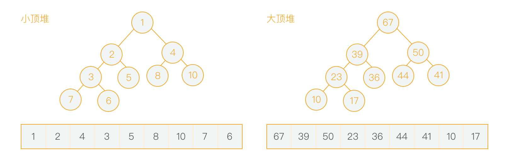

> 图、树的定义
>
> 一些基于树的特殊树的概念
>
> 二叉堆以及它的一些操作
>
> 基于二叉堆的堆排序
>
> 基于二叉堆的优先队列
>
----

### graph

图（graph）是数据结构和算法学中最强大的框架，几乎可以用来表现所有类型的结构或系统。

它并不是指图形图像（image）或地图（map）。通常来说，会把图视为一种由`顶点`组成的抽象网络，网络中的各顶点可以通过`边`实现彼此的连接，用来表示两顶点有关联。在图论中对这两个概念使用vertex（顶点）和edge（边）来表示。

抛却小部分差异性，抽离出来具有共同性的图可以分为：无向图（简单连接）、有向图（连接有方向性）、加权图（连接带有权值）和加权有向图（连接既有方向性又带有权值）。

不过大多数数据结构和算法中使用`无向图`会多一点，而无向图中使用较多的就是`树（tree）`这种数据结构。

### tree

树是一种特殊的数据结构，具备根节点（root-node）以及其对应的子节点（child-node），每一个树都有且只有一个根节点，每一个节点却可以有多个子节点，没有子节点的节点称为叶子节点（leaf-node）。

节点有在树中的位置指示概念：高度(height)、深度(depth)。高度的意思是指从该节点出发到达该节点最远的那一层的叶子节点需要多少步，深度是指从根节点到达该节点需要多少步。

在树中除了节点这一个基本概念之外，还有`height`和`level`来表示树的一些特性。一颗树的height指的是从根节点到最远的叶子节点需要经过的步数，而level则指的是一个树有多少层，height和level之间的关系为：`level = height + 1`。

二叉树是树中一种具备特殊形态的分类：每一个节点最多有两个子节点。在计算机领域中比较常用的树是**二叉树**，因为他有特殊的结构：

* 每一个节点最多有两个子节点
* 对于`节点i`来说，他的两个子节点的位置分别为`2*i`和`2*i + 1`
* 对于一个`节点j`来说，他的父节点的位置为`j/2`

对于一个二叉树来说，有一种情况称为`满二叉树`：1️⃣除最后一层外所有节点均有两个子节点，2️⃣且最后一层的节点数达到最大。

而如果倒数第二层以及以上各层均达到最大节点数，只有最后一层没有达到最大节点，并且所有的子节点均集中在左边的二叉树称为`完全二叉树`。

### 树的实现

这里仅仅针对于比较常用的二叉树进行举例，要实现一个树这种数据结构，可以使用`数组`和`链表`。

使用数组的好处是简单，数据操作方便，不好的地方是数组需要开辟的空间地址是连续的。对于二叉树来说，使用数组实现的话，可能有空节点，大多数情况下用数组表示数不是很有效率，除非是完全二叉树。对于普通的二叉树，特别是有很多空节点就会有很多空洞，浪费存储空间。因此`如果是一个完全二叉树，使用数组确是很方便的一种实现方式`。

使用链表便于插入和删除元素，并且内存地址不需要连续，但是查找速度太慢。使用链表来实现树可以有两种方法：二叉链表和三叉链表。二叉链表和双向链表一样，只不过节点的指针不是指向父节点和下一个节点，而是两个指针指向两个子节点，三叉链表也和双向链表类似，不过每一个节点都有三个指针，分别指向父节点和两个子节点。

> * [7-重建二叉树](https://github.com/CyC2018/Interview-Notebook/blob/master/notes/剑指%20offer%20题解.md#7-重建二叉树)
> * [8-二叉树的下一个结点](https://github.com/CyC2018/Interview-Notebook/blob/master/notes/剑指%20offer%20题解.md#8-二叉树的下一个结点)
> * [27-二叉树的镜像](https://github.com/CyC2018/Interview-Notebook/blob/master/notes/剑指%20offer%20题解.md#27-二叉树的镜像)
> * [28-对称的二叉树](https://github.com/CyC2018/Interview-Notebook/blob/master/notes/剑指%20offer%20题解.md#28-对称的二叉树)

### 二叉堆

堆是一种数据结构，通常会被看做是一个二叉树的形式来表示存储在数组中的数据，在二叉树的定义上，堆还有一些其他的特点：1️⃣堆是一个完全二叉树；2️⃣堆中某一个节点的值总是`小于等于`或者`大于等于`其子节点（如果有子节点）的值。

而根据子节点和父节点之间的大小关系，二叉堆又可以分为大顶堆和小顶堆，根据这个特性就可以很容易的找出堆中的最大（最小）值：

如何将一个数组转化成堆（这里使用小顶堆）呢？也可以理解成如何根据一个数组创建一个堆？

### heapify

创建一个堆的方法可以有两种：1️⃣使用堆调整方法对原数组进行调整元素；2️⃣创建一个空堆根据堆的定义对其进行元素的插入。这两种方法的时间复杂度分别为：O(n)、O(nlog n)。并且有可能最后创建出来的堆不是同一个堆，因为堆中并没有定义两个子节点如何排序，仅仅规定了子节点和父节点之间的关系。

为了节省空间，这里使用第一种方法构建堆。无序数组建立堆最直接的方法是从左到右遍历数组，然后进行上浮操作。一个**更高效的方法是从右至左进行下沉操作**，如果一个节点的两个节点都已经是堆有序，那么进行下沉操作可以使得这个节点为根节点的堆有序。叶子节点不需要进行下沉操作，因此可以忽略叶子节点的元素，因此只需要遍历一半的元素即可。

### siftUp

在小顶堆中，当一个节点比父节点大，那么需要交换这个两个节点。交换后还可能比它新的父节点大，因此需要不断地进行比较和交换操作，把这种操作称为`上浮`。

### siftDown

### insert

在堆的操作中，插入元素一般都是在末尾处进行，在末尾进行插入，如果堆的结构被破坏，只需要进行`siftUp`操作就可以重建堆。**注：这里使用小顶堆举例**。

在末尾插入元素，只需要对插入元素和其父节点进行比较，如果小于父节点，则将其与父节点进行交换位置，直到形成一个堆为止，这样的操作需要消耗的时间为**O(log n)**。

### delete

堆这种数据结构通常会用来构建`优先队列`，通过由数组（或其他结构）实现的堆，一般删除的都是根节点，也就是重要性最高的元素。

在删除根节点之后，堆的特性可能会被打破，这时候就需要重新构建堆。在删除操作之后重新构建堆，一般会把数组中的最后一个节点移到根节点，然后对其执行`siftDown`操作，对不重要的元素进行下沉，直到重新形成一个堆，这样的操作消耗的时间也为**O(log n)**。

除了移除根节点这种操作，还可以指定索引进行移除元素，和删除根节点类似，将删除索引处的元素和最后一个元素进行交换位置，为了重新构建堆，可能会进行siftUp以及siftDown操作，在这个例子里是只进行了siftDown。

### 堆排序

由于堆的特殊性质：最大、最小元素在根节点，如果使用数组表示堆，那么最重要的元素索引为0。结合堆的siftDown、delete操作，可以将堆中的第一个元素和最后一个元素交换位置（不删除，仅置换位置），从最后一个元素向前的数组重新转化成堆，依次进行直到所有元素都置换了位置。堆排序的一个特点为`它是原地排序，不占用额外空间`。

因此对一个数组进行堆排序就需要两个步骤：1️⃣从数组构建堆；2️⃣执行替换、构建堆操作。这两个操作上面都已经有过解释，这里仅仅演示对一个数组使用堆排序的过程。

需要说明的一点是，如果要对一个数组进行升序排列，需要通过数组构建大顶堆；如果要对一个数组进行降序排列，需要构建小顶堆。

以上面【3，4，6，8，7，10】的小顶堆为例，进行数组的降序排列，目标数组为【10，8，7，6，4，3】。

