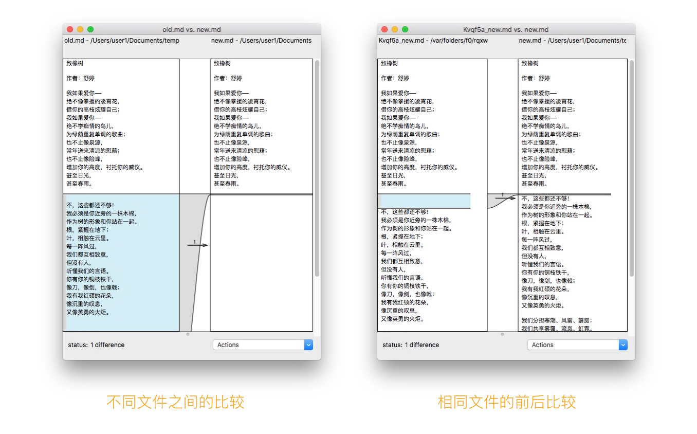

找出来两个图片是否相同

```objective-c
- (BOOL)image:(UIImage *)image1 isEqualTo:(UIImage *)image2
{
    NSData *data1 = UIImagePNGRepresentation(image1);
    NSData *data2 = UIImagePNGRepresentation(image2);

    return [data1 isEqual:data2];
}
```


```objective-c

// This makes debugging much more fun
typedef union {
    uint32_t raw;
    unsigned char bytes[4];
    struct {
        char red;
        char green;
        char blue;
        char alpha;
    } __attribute__ ((packed)) pixels;
} FBComparePixel;

@implementation UIImage (Compare)

// 比较两个图片是否相同，tolerance是比较的偏差
- (BOOL)fb_compareWithImage:(UIImage *)image tolerance:(CGFloat)tolerance
{
  NSAssert(CGSizeEqualToSize(self.size, image.size), @"Images must be same size.");
  
//    reference 参照物
  CGSize referenceImageSize = CGSizeMake(CGImageGetWidth(self.CGImage), CGImageGetHeight(self.CGImage));
  CGSize imageSize = CGSizeMake(CGImageGetWidth(image.CGImage), CGImageGetHeight(image.CGImage));
    
  // The images have the equal size, so we could use the smallest amount of bytes because of byte padding
  size_t minBytesPerRow = MIN(CGImageGetBytesPerRow(self.CGImage), CGImageGetBytesPerRow(image.CGImage));
  size_t referenceImageSizeBytes = referenceImageSize.height * minBytesPerRow;
    
  void *referenceImagePixels = calloc(1, referenceImageSizeBytes);
  void *imagePixels = calloc(1, referenceImageSizeBytes);

  if (!referenceImagePixels || !imagePixels) {
    free(referenceImagePixels);
    free(imagePixels);
    return NO;
  }
  
  CGContextRef referenceImageContext = CGBitmapContextCreate(referenceImagePixels,
                                                             referenceImageSize.width,
                                                             referenceImageSize.height,
                                                             CGImageGetBitsPerComponent(self.CGImage),
                                                             minBytesPerRow,
                                                             CGImageGetColorSpace(self.CGImage),
                                                             (CGBitmapInfo)kCGImageAlphaPremultipliedLast
                                                             );
  CGContextRef imageContext = CGBitmapContextCreate(imagePixels,
                                                    imageSize.width,
                                                    imageSize.height,
                                                    CGImageGetBitsPerComponent(image.CGImage),
                                                    minBytesPerRow,
                                                    CGImageGetColorSpace(image.CGImage),
                                                    (CGBitmapInfo)kCGImageAlphaPremultipliedLast
                                                    );

  if (!referenceImageContext || !imageContext) {
    CGContextRelease(referenceImageContext);
    CGContextRelease(imageContext);
    free(referenceImagePixels);
    free(imagePixels);
    return NO;
  }

  CGContextDrawImage(referenceImageContext, CGRectMake(0, 0, referenceImageSize.width, referenceImageSize.height), self.CGImage);
  CGContextDrawImage(imageContext, CGRectMake(0, 0, imageSize.width, imageSize.height), image.CGImage);

  CGContextRelease(referenceImageContext);
  CGContextRelease(imageContext);

  BOOL imageEqual = YES;

  // Do a fast compare if we can
  if (tolerance == 0) {
    imageEqual = (memcmp(referenceImagePixels, imagePixels, referenceImageSizeBytes) == 0);
  } else {
    // Go through each pixel in turn and see if it is different
    const NSInteger pixelCount = referenceImageSize.width * referenceImageSize.height;

    FBComparePixel *p1 = referenceImagePixels;
    FBComparePixel *p2 = imagePixels;

    NSInteger numDiffPixels = 0;
    for (int n = 0; n < pixelCount; ++n) {
      // If this pixel is different, increment the pixel diff count and see
      // if we have hit our limit.
      if (p1->raw != p2->raw) {
        numDiffPixels ++;

        CGFloat percent = (CGFloat)numDiffPixels / pixelCount;
        if (percent > tolerance) {
          imageEqual = NO;
          break;
        }
      }

      p1++;
      p2++;
    }
  }
```


### diff

diff是一种算法， 目的是比较出来两个对象之间的不同之处，最典型的应用就是git中的`diff操作`，可以用来展示文件修改前后的差异。另外，在Mac上有自带的软件FileMerge可以用来比较两个文件的差异：




### 最长公共子序列


### update UITableView&UICollectionView

https://github.com/jflinter/Dwifft

https://github.com/onmyway133/DeepDiff

https://github.com/wokalski/Diff.swift

https://github.com/Wondermall/Doppelganger

https://github.com/Instagram/IGListKit/blob/master/Guides/IGListDiffable%20and%20Equality.md

---

https://stackoverflow.com/questions/3400707/comparing-uiimage