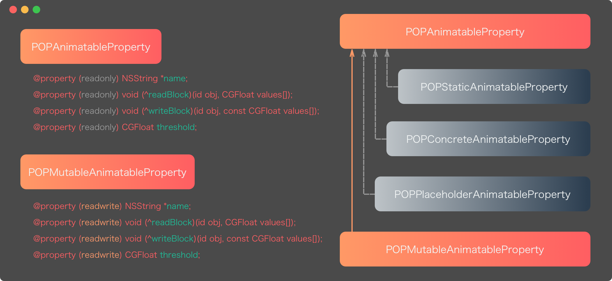

> 类簇是什么
>
> Pop开源框架中的类簇模式的使用实践
>
> 类簇这种模式可以用来做什么

----

### what's class clusters

### pop

在pop中有一个用来设置动画属性的类，在`.h`文件中看只有两个类，然而在具体实现中却有右边五个类（3个私有类+2个公开类），从每个类的名字中可以看出来，这几个类的作用分别是（从上至下）：不可变、静态类、具体类、占位类、可变类。

### 如何使用类簇到项目中

---

https://developer.apple.com/library/archive/documentation/General/Conceptual/CocoaEncyclopedia/ClassClusters/ClassClusters.html

http://blog.sunnyxx.com/2014/12/18/class-cluster/