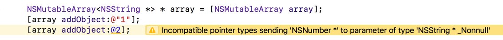
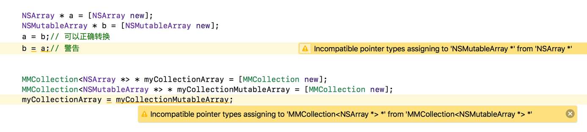

> 里氏替换原则
>
> 协变与逆变
>
> 如何使用泛型增强类的稳定性

---

### Lightweight Generics

泛型是一种程序语言设计范式，可以延迟确定类型，这一点在swift中有很广泛的引用，从Xcode7发布之后，Objective-C也开始支持泛型，不过是轻量级的，系统提供的集合类：NSArray、NSDictionary、NSSet等都是支持泛型的。比如下面是NSArray的头文件，其中使用ObjectType来表示泛型：

```objective-c
@interface NSArray<__covariant ObjectType> : NSObject
- (ObjectType)objectAtIndex:(NSUInteger)index;
...
@end
```

那么在使用的时候就可以这样使用


这样既可以使用编译器的提醒功能，还能在传入错误的类型的时候进行警告



借鉴系统的类，可以实现自定义的类中使用泛型来约束类型，比如设计一个集合类：

```objective-c
@interface MMCollection<T> : NSObject
- (void) addObject:(T)object;
- (T) objectAtIndex:(NSUInteger)index;
@end
    
@implementation MMCollection
- (void)addObject:(id)object{
}
- (id) objectAtIndex:(NSUInteger)index{
    return nil;
}
@end
```
另外泛型中还可以加入一些其他的约束，比如要求泛型准守某些协议、泛型必须是某个类型的类，这样在编译阶段如果设置了具体的类就可以起到校验的作用，如果使用了没有按规定的类来作为泛型就会发出警告：
```objective-c
@interface MMCollection<T : id<NSCopying>> : NSObject
@end
    
@interface MMCollection<T : NSArray*> : NSObject
@end
```

还有一点是，类中如果使用泛型，不仅仅可以使用一个，可以使用多个，多个泛型和一个的时候一样，都可以设置一些其他的约束，参考系统NSDictionary的头文件：

```objective-c
@interface NSDictionary<__covariant KeyType, __covariant ObjectType> : NSObject
- (ObjectType)objectForKey:(KeyType)aKey;
@end
```


### [里氏替换原则](https://baike.baidu.com/item/里氏替换原则/3744239)

在面向对象编程中，通过子类初始化的对象可以使用父类来声明，比如：

```objective-c
NSArray * array = [NSMutableArray array];
// 在运行时array是一个NSMutableArray的实例
```

这就是里氏替换原则的一个体现，它是继承的基础。但是这样的代码下，array是不可以调用NSMutableArray特有的API，因为编译器认为他是一个NSArray类的实例对象。

根据这个特性对上面的`MMCollection`这个类进行子类的替换，却发现报和子类转成父类的时候一样的警告：



这里会有一些地方比较困惑：

* 使用泛型中的子类创建的MMCollection对象却不可以转成泛型中父类创建的MCollection对象
* 通过警告可以知道，是将两个不同类型的对象相互转换，但是明明myCollectionArray 和myCollectionMutableArray 这两个对象中的泛型具备里氏替换原则中的集成关系


### __covariant

回过头来看看NSArray的头文件，在泛型前面有一个关键字`__covariant`，这个关键字是**协变**，协变可以完成这样的操作：如果变量A的占位符类型是子类，那么可以把它赋值给占位符类型是父类的B。

那么对MMCollection类进行改进一下就可以实现子类泛型对父类泛型的转换：

```objective-c
@interface MMCollection<__covariant T : NSArray*> : NSObject
....
    
MMCollection<NSArray *> * myCollectionArray = [MMCollection new];
MMCollection<NSMutableArray *> * myCollectionMutableArray = [MMCollection new];
myCollectionArray = myCollectionMutableArray;// 可以通过编译，不会有警告
```

另外通过查看NSArray、NSDictionary、NSSet这些集合类，他们都是使用协变来修饰泛型的。


### __contravariant

__contravariant关键字是**逆变**的意思，作用和协变相反：如果变量A的占位符类型是父类，那么可以把它赋值给占位符类型是子类的B。

```objective-c
@interface MMCollection<__contravariant T : NSArray*> : NSObject
....
    
MMCollection<NSArray *> * myCollectionArray = [MMCollection new];
MMCollection<NSMutableArray *> * myCollectionMutableArray = [MMCollection new];
myCollectionMutableArray = myCollectionArray;// 可以通过编译，不会有警告
```

初一看这样做确实找不到什么现实意义，但就是有这样的作用，而且在Funaction中也没有发现有这样使用的地方。


----

