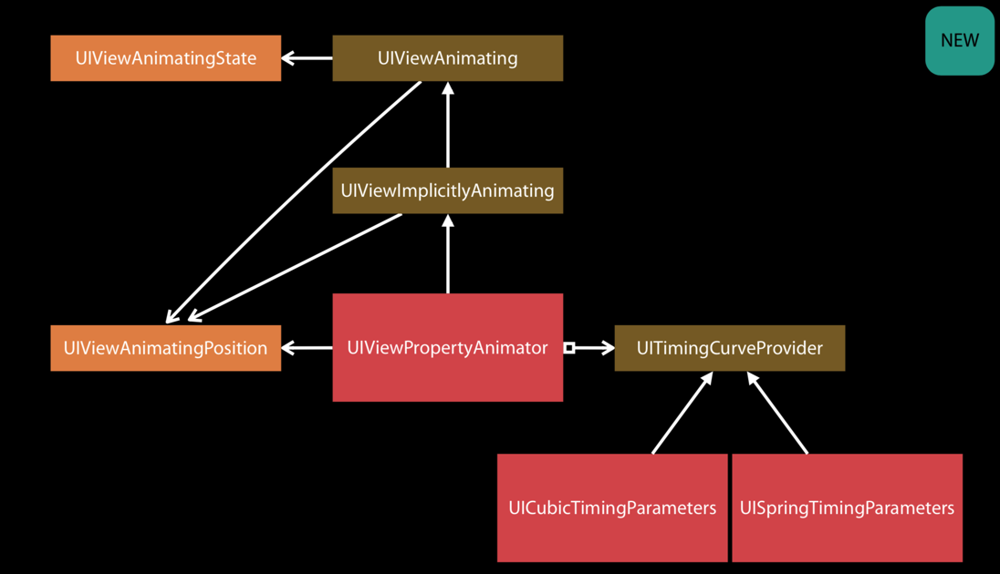

> UIView提供的block动画有哪些不便？
>
> 如何优化UIView的block动画？
>
> 一个更加全面的动画库是怎么设计的？

---

### UIView animator

系统提供了基于block的UIView动画api，可以用于基础的视图动画效果，这在初次接触UI开发的时候被窝认为是一个很神奇的存在，一段代码就可以完成一个视图的位移动画。但是随着对iOS开发的深入，会发现这样的api在使用的时候会有诸多的不便，主要体现在：

* 动画的执行接口不可以动态调控，比如设置缺省值、不写complet回调、调换参数的设置顺序
* 组合动画写起来会很不直观
* 对动画的可控性很差

在iOS10之后，系统提供了一个新的动画类：`UIViewPropertyAnimator`，这个类提供给开发者更多的动画可控性，关于这个新特性，还有一个相关session：[wwdc2016 session-216](https://developer.apple.com/videos/play/wwdc2016/216/)。

在实现帧动画的时候不能直接对帧动画进行时间的使用，需要手动的记录前一帧的动画时长，依次算下来，需要很多计算

----

https://developer.apple.com/documentation/uikit/animation_and_haptics/property-based_animations?language=objc

https://developer.apple.com/videos/play/wwdc2016/216/