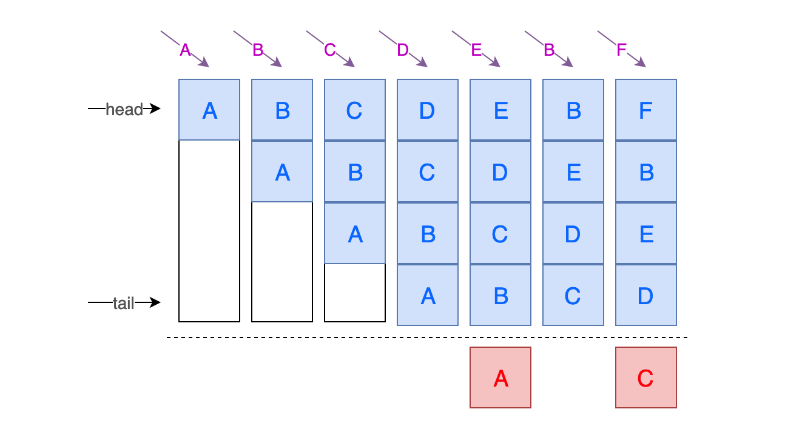

> 什么是LRU
>
> 实现LRU的多种方式
>
> 开源框架中对LRU的实现，比如YYCache

---

### LRU（Least recently used）

字面意思是最近最少使用，如果一个文件最近很少使用，在内存不足的时候，可以优先考虑把这个文件删除以节省内存空间。因此一个很简单的想法就是使用一个队列来保存数据，在新插入数据的时候进行遍历队列，如果队列已经满了就将尾部的数据进行移除，示意图如下：

但是这样的效率是很低的，即使换成链表也不高效，

数组+链表

红黑树

hashmap

linkedHashMap 也就是 map+链表

### LRU-K
这是一种LRU的改进算法，其中的K表示最近的使用次数，

### 查询O(1)

### YYCache

YYCache的作者创造了一个新的缓存工具，有磁盘缓存和内存缓存两种应用场景，其中的内存缓存部分中有实现对应的LRU算法，作者原话如下：
> YYMemoryCache 是我开发的一个内存缓存.....另外，缓存内部用双向链表和 NSDictionary 实现了 LRU 淘汰算法，相对于上面几个算是一点进步吧。

双向链表加字典，其实就是map+链表的实现方式，

---

[link](link.com)
https://www.cnblogs.com/Dhouse/p/8615481.html